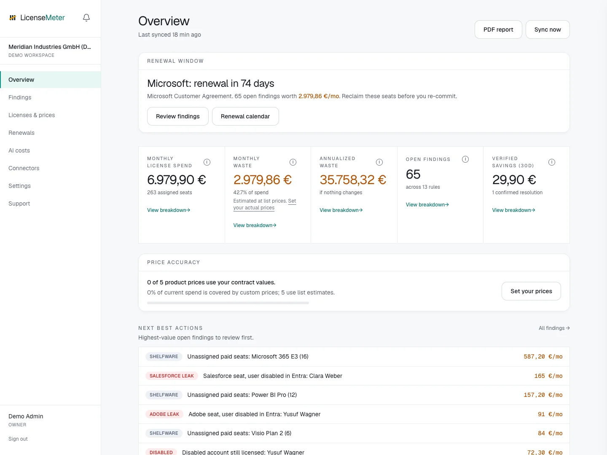

# Welcome

LicenseMeter brings Microsoft 365 license findings, SaaS seats and AI API spending into one workspace. Use it to identify accounts that still hold licenses, investigate inactivity, prepare for renewals, and track whether a later sync confirms an issue has been resolved.

Scans, findings, reports and exports are free on the hosted application, with no time limit. Paid plans add 24 months of history instead of 12, a signed data processing agreement, MCP access and features for managed service providers; see [pricing](https://www.licensemeter.com/pricing). You can also run your own installation with Docker, which includes every feature.

<figure><figcaption>
LicenseMeter sample workspace. All names, costs and findings shown are demonstration data.
</figcaption></figure>

New here? Follow [Getting started](getting-started/README.md) for the complete onboarding path, or [explore the sample workspace](getting-started/sample-workspace.md) without an account.

## Start with the question you need to answer

<table data-view="cards"><thead><tr><th></th><th></th><th data-hidden data-card-target data-type="content-ref"></th></tr></thead><tbody><tr><td><strong>Set up your workspace</strong></td><td>Follow sign-in, connection, first-sync checks and your first finding review.</td><td><a href="getting-started/README.md">Getting started</a></td></tr><tr><td><strong>Connect your data</strong></td><td>Choose a live connector, one-time scan, or CSV import.</td><td><a href="connectors/README.md">Connectors</a></td></tr><tr><td><strong>Review license waste</strong></td><td>Understand findings and decide which accounts need investigation.</td><td><a href="findings/README.md">Findings</a></td></tr><tr><td><strong>Use your contract prices</strong></td><td>Replace list estimates before reporting savings opportunities.</td><td><a href="licenses-and-prices.md">Licenses and prices</a></td></tr><tr><td><strong>Track AI spending</strong></td><td>Separate API costs from ChatGPT and Claude seat costs.</td><td><a href="ai-costs.md">AI costs</a></td></tr><tr><td><strong>Self-host</strong></td><td>Run a dedicated instance with your own database and credentials.</td><td><a href="self-hosting/README.md">Self-hosting</a></td></tr></tbody></table>


LicenseMeter reads provider data. It does not automatically remove licenses, disable users or change your tenant. Findings are review candidates. Any remediation is a separate administrative action.


[Open LicenseMeter](https://www.licensemeter.com) · [Product updates](https://changelog.ugurlabs.com/?product=licensemeter) · [Source code](https://github.com/ugurkocde/licensemeter-website)
