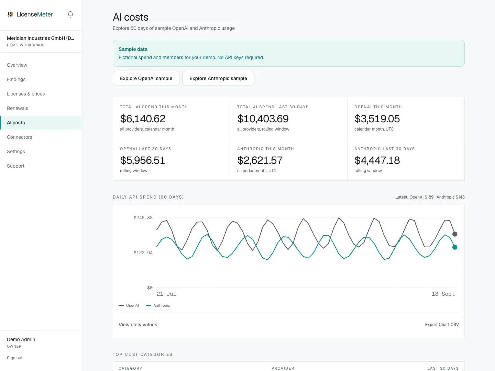

# AI API costs

Open **AI costs** for daily spending from connected OpenAI and Anthropic API organizations. Connect these providers individually from **Connectors**.

<figure><figcaption>
LicenseMeter sample workspace. All names, costs and findings shown are demonstration data.
</figcaption></figure>

## API costs and subscription seats

| Cost type | Source | Price basis |
| --- | --- | --- |
| OpenAI API | OpenAI Admin API key | Provider-reported daily costs in USD |
| Claude API | Anthropic Admin API key | Provider-reported daily costs in USD |
| ChatGPT subscription seats | Imported workspace members | Your per-seat price book |
| Claude subscription seats | Imported workspace members | Your per-seat price book |

API costs stay in USD and are not converted to the workspace's license currency. The connector does not read prompts or responses. Console membership is checked separately from usage costs.

## Read the chart

Check the date range, provider split and latest sync. The initial OpenAI sync requests up to 180 days of history; Anthropic requests around 90 days, subject to available provider data. Very recent provider reporting can lag current use.

Sample AI pages are labeled **Sample data** and **No live connection**. They are for learning the interface and do not indicate that a key has been connected. Sample CSV downloads contain illustrative figures.

If live costs are missing, confirm that you supplied an organization admin key, not a regular model-inference key, then inspect the provider's connector status and sync history.

Setup guides: [OpenAI](connectors/openai.md) and [Anthropic](connectors/anthropic.md).
