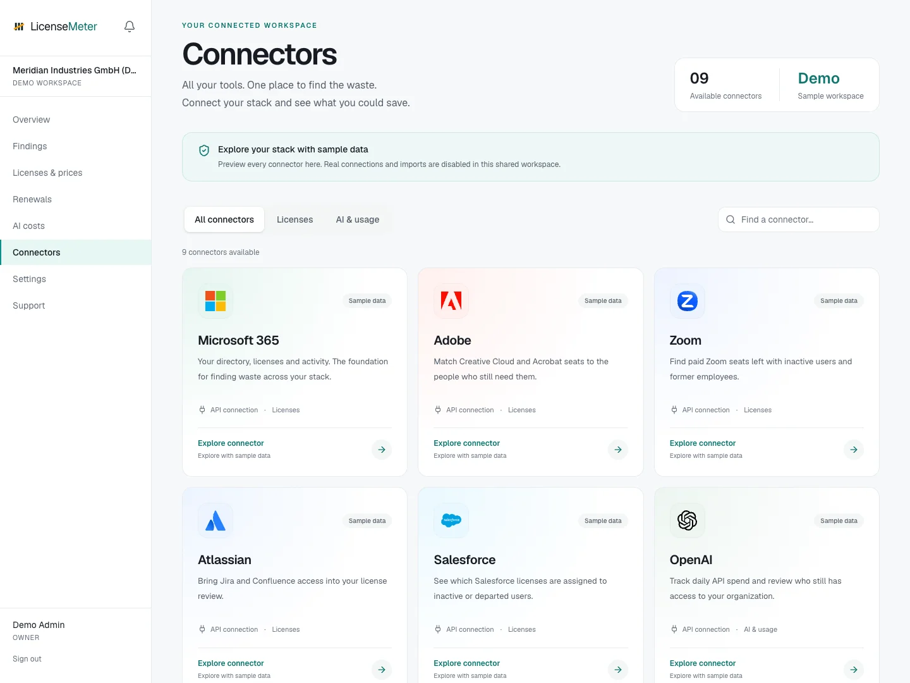

# Connectors

Open **Connectors** in the workspace sidebar. Select a provider to see its connection status, supported data and setup controls.

<figure><figcaption>
LicenseMeter sample workspace. All names, costs and findings shown are demonstration data.
</figcaption></figure>

| Provider | Connection | Main data |
| --- | --- | --- |
| [Microsoft 365](microsoft.md) | Provider API | Directory, license inventory and available activity reports |
| [Adobe](adobe.md) | Provider API | Members, entitlements and activity where available |
| [Zoom](zoom.md) | Provider API | Members, entitlements and activity where available |
| [Atlassian](atlassian.md) | Provider API | Members, entitlements and activity where available |
| [Salesforce](salesforce.md) | Provider API | Members, entitlements and activity where available |
| [OpenAI](openai.md) | Provider API | Console membership and daily API costs |
| [Anthropic](anthropic.md) | Provider API | Console membership and daily API costs |
| [ChatGPT](chatgpt.md) | Pasted CSV or member table | Members, entitlements and activity where available |
| [Claude](claude.md) | Pasted CSV or member table | Members, entitlements and activity where available |

## Before connecting

Use an Admin or Owner role in LicenseMeter. Obtain the provider access described on its guide, then enter credentials only in the connector's secure fields. A provider may grant a credential broader authority than LicenseMeter uses; the application performs read operations, but the credential itself must still be protected.

A live Microsoft 365 connection is a prerequisite for these additional provider connectors, including ChatGPT and Claude imports. CSV-only assessments and instant scans do not unlock them. If the page says to connect or reconnect Microsoft, complete that first. Directory matching uses the connected Microsoft directory. A person without a match may be an external collaborator or use a different email address; investigate before treating them as departed.

## After connecting

Check validation, run a sync if needed, inspect the provider page and update the [price book](../licenses-and-prices.md). If a credential expires, replace it through the same connector controls and verify the next sync.

For imported providers, re-import a current member table whenever you need fresh results. The import replaces that provider's previous snapshot.
