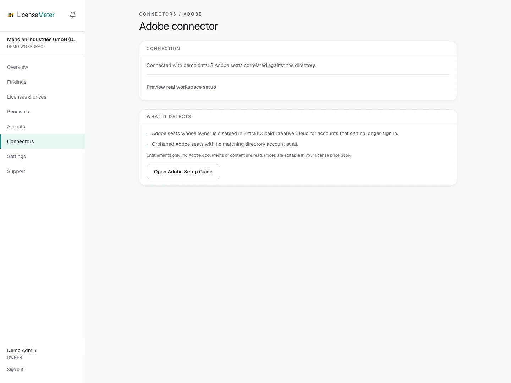

# Adobe

Adobe seats are expensive and offboarding rarely reaches the Admin Console. LicenseMeter reads the user list and filters memberships to product-profile entitlements through the User Management API, then cross-checks every seat against Entra ID.

Open **Connectors > Adobe** in your workspace.

<figure><figcaption>
LicenseMeter sample workspace. All names, costs and findings shown are demonstration data.
</figcaption></figure>


The screenshot shows sample data, not a live connection or provider consent screen. In your own workspace, the page presents the appropriate connection or import controls.


## Setup



### Create the API project

In the Adobe Developer Console, create or open a project and add the User Management API with OAuth Server-to-Server credentials. This requires the Adobe System Administrator role; the Developer role alone cannot create the User Management API integration.

[Adobe User Management API documentation](https://adobe-apiplatform.github.io/umapi-documentation/en/)



### Copy the credentials

The credential details page shows the organization ID, client ID and client secret: the three values LicenseMeter asks for.



### Connect

Paste the three values on the Adobe connector page. LicenseMeter validates them against the API before storing anything; the secret is encrypted at rest (AES-256-GCM).



## Data used

- The user list: email, name and account status
- Product profile entitlements per user, filtered from Adobe group memberships

## Outside this connector's scope

- Files, libraries or any Creative Cloud content
- Usage data: Adobe's API exposes entitlements only, so there is no inactivity signal

## Findings and limitations

- Creative Cloud seats held by accounts that are disabled in Entra ID.
- Seats with no matching directory account at all.

Adobe exposes entitlements here, not application usage. LicenseMeter cannot infer Creative Cloud inactivity from this connector alone.

After setup, check the refresh timestamp and [set contract prices](../licenses-and-prices.md) for any seat-based products. If validation or sync fails, start with [Troubleshooting](../troubleshooting/README.md).
