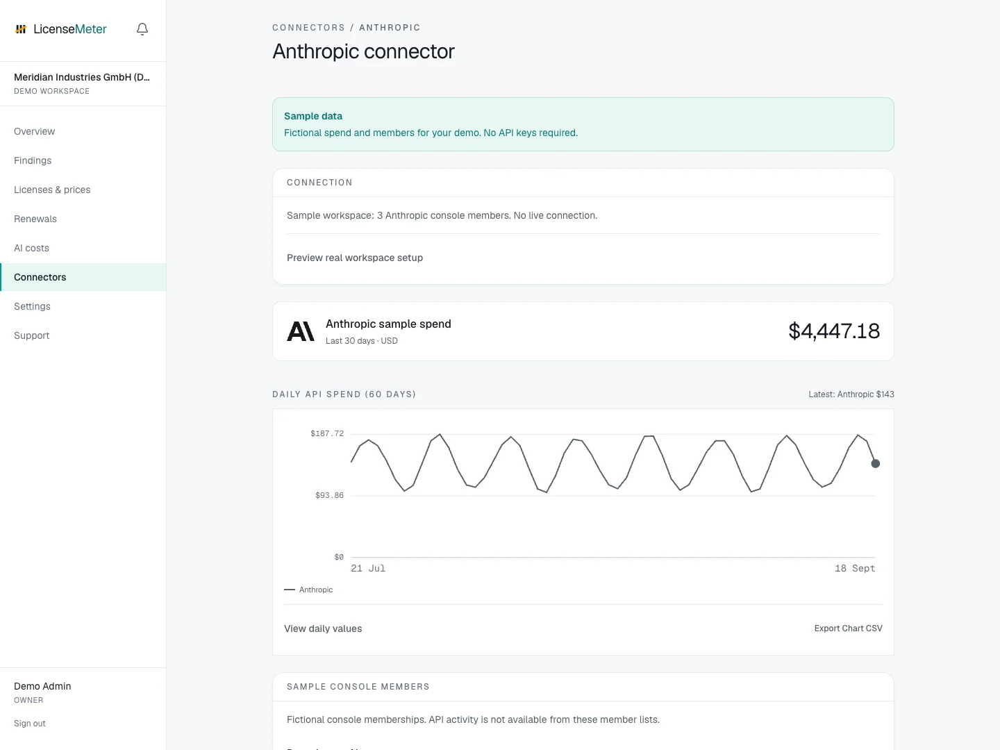

# Anthropic

With one Admin API key, LicenseMeter backfills around 90 days of daily Claude API cost data and cross-checks every console member against Entra ID.

Open **Connectors > Anthropic** in your workspace.

<figure><figcaption>
LicenseMeter sample workspace. All names, costs and findings shown are demonstration data.
</figcaption></figure>


The screenshot shows sample data, not a live connection or provider consent screen. In your own workspace, the page presents the appropriate connection or import controls.


## Setup



### Create an Admin API key

An organization admin opens the Claude Console (platform.claude.com) under Organization settings > Admin keys and provisions a key, which starts with sk-ant-admin. Admin keys exist on organization accounts, not on individual ones.

[Anthropic Admin API documentation](https://platform.claude.com/docs/en/manage-claude/admin-api)



### Connect

Paste the key into the single field on the Anthropic connector page. Validated read-only before storage, encrypted at rest (AES-256-GCM).



### Let the first sync backfill

Around 90 days of daily cost data by model plus the console member list arrive with the first sync. Spend shows on the AI costs page in USD, exactly as billed.

[Anthropic Usage and Cost API](https://platform.claude.com/docs/en/api/usage-cost-api)



## Data used

- Console organization members: email and name
- Daily cost totals by model

## Outside this connector's scope

- Prompts, responses or any request content
- Your workspace API keys' secrets

## Findings and limitations

- Console members whose Entra ID account is disabled: departed people who may still hold live API keys.
- Console members with no matching directory account at all.
- Daily API spend by model, backfilled on first sync and tracked on the AI costs page.

This connector is for Claude API console costs and members. It does not import Claude Team or Enterprise subscription seats. Use the separate Claude CSV connector for those.

After setup, check the refresh timestamp and [set contract prices](../licenses-and-prices.md) for any seat-based products. If validation or sync fails, start with [Troubleshooting](../troubleshooting/README.md).
