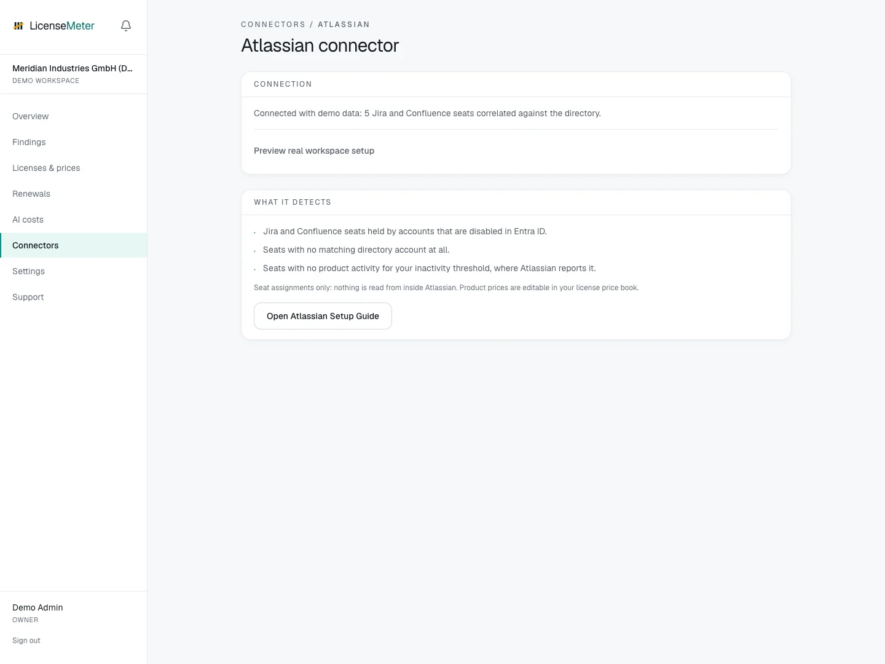

# Atlassian

Atlassian product access survives offboarding more often than most. LicenseMeter reads managed users and their product access through the organization admin API and cross-checks each seat against Entra ID.

Open **Connectors > Atlassian** in your workspace.

<figure><figcaption>
LicenseMeter sample workspace. All names, costs and findings shown are demonstration data.
</figcaption></figure>


The screenshot shows sample data, not a live connection or provider consent screen. In your own workspace, the page presents the appropriate connection or import controls.


## Setup



### Create an organization API key

In Atlassian Administration (admin.atlassian.com) under Organization settings > API keys, create a key. Only users with the organization admin role can do this. If the key offers API scopes, include read:accounts:admin (or create it without scopes). The connector reads managed accounts, so your organization needs at least one verified domain; unverified accounts are not returned.

[Atlassian organization admin API documentation](https://support.atlassian.com/organization-administration/docs/manage-an-organization-with-the-admin-apis/)



### Note the organization ID

It is part of the Atlassian Administration URL (admin.atlassian.com/o/<organization-id>) and shown alongside the API key.



### Connect

Paste the organization ID and the API key on the Atlassian connector page. Validated before storage, encrypted at rest.



## Data used

- Managed users: email, name and account status
- Product access per user (Jira, Confluence) and last activity where Atlassian reports it

## Outside this connector's scope

- Issues, pages, projects or any content inside the products

## Findings and limitations

- Jira and Confluence seats held by accounts that are disabled in Entra ID.
- Seats with no matching directory account at all.
- Seats with no product activity for your inactivity threshold, where Atlassian reports it.

Managed-account coverage depends on verified domains. A successful connection with a partial user list should be investigated before treating absent users as offboarded.

After setup, check the refresh timestamp and [set contract prices](../licenses-and-prices.md) for any seat-based products. If validation or sync fails, start with [Troubleshooting](../troubleshooting/README.md).
