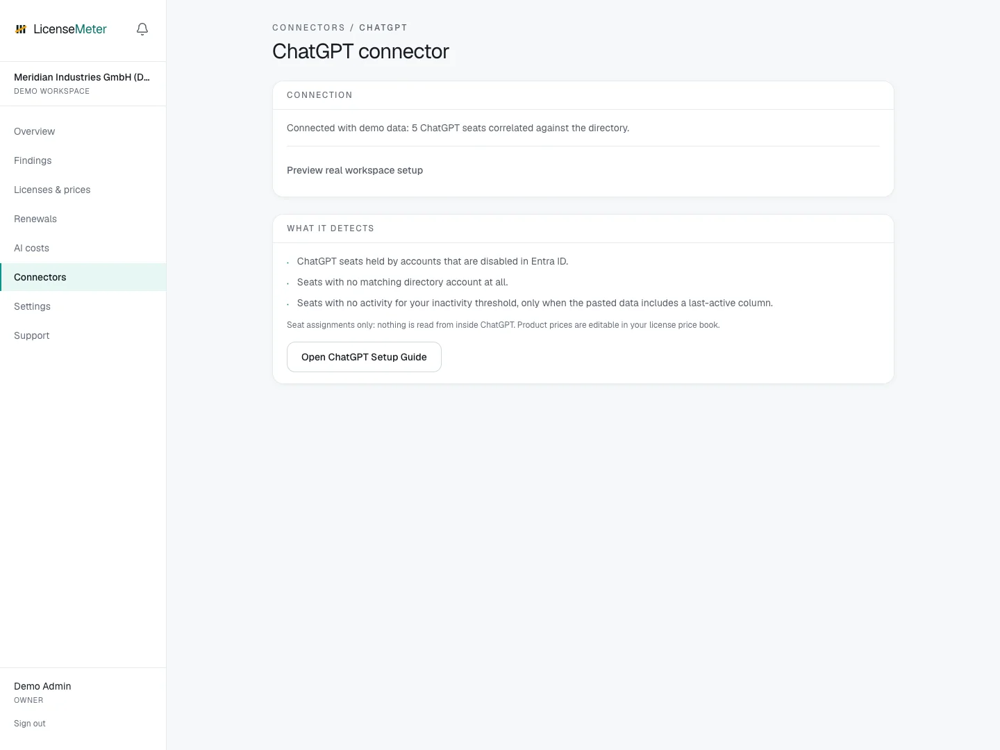

# ChatGPT

ChatGPT seats are bought fast and reviewed rarely. Paste a member table or analytics export if your workspace provides one, and LicenseMeter prices every seat held by someone who is disabled, gone or inactive when the pasted data includes activity dates.

Open **Connectors > ChatGPT** in your workspace.

<figure><figcaption>
LicenseMeter sample workspace. All names, costs and findings shown are demonstration data.
</figcaption></figure>


The screenshot shows sample data, not a live connection or provider consent screen. In your own workspace, the page presents the appropriate connection or import controls.


## Setup



### Prepare the member data

In ChatGPT workspace settings or analytics, use a member table or CSV export if it is available for your workspace. Include the header row so LicenseMeter can detect the available columns.

[OpenAI: Managing members in ChatGPT Enterprise](https://help.openai.com/en/articles/8266401-managing-members-seat-types-roles-and-access-in-chatgpt-enterprise)



### Paste it

On the ChatGPT connector page, paste the table or export. Email is required; name, seat type, status and last activity are detected when those columns are present. Comma, semicolon and tab formats all work.



### Price the seats

Set your per-seat price under Licenses & prices (chatgpt:<seat type>) so findings carry your real numbers. Re-import any time. Each paste replaces the previous snapshot.



## Data used

- Only what is in your paste: member emails, names, seat types, and status or last-active dates when included

## Outside this connector's scope

- Conversations, prompts or anything inside ChatGPT: no ChatGPT credentials are stored at all

## Findings and limitations

- ChatGPT seats held by accounts that are disabled in Entra ID.
- Seats with no matching directory account at all.
- Seats with no activity for your inactivity threshold, only when the pasted data includes a last-active column.

Activity-based findings require activity dates in the pasted data. A member list without those dates can still support directory matching, but does not establish inactivity.

After setup, check the refresh timestamp and [set contract prices](../licenses-and-prices.md) for any seat-based products. If validation or sync fails, start with [Troubleshooting](../troubleshooting/README.md).
