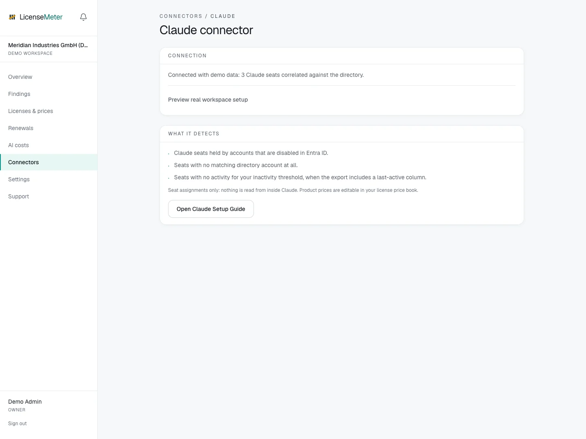

# Claude

Claude seats follow the same offboarding physics as every other subscription. Paste the member list from the admin settings and LicenseMeter prices every seat held by someone who is disabled, gone or inactive.

Open **Connectors > Claude** in your workspace.

<figure><figcaption>
LicenseMeter sample workspace. All names, costs and findings shown are demonstration data.
</figcaption></figure>


The screenshot shows sample data, not a live connection or provider consent screen. In your own workspace, the page presents the appropriate connection or import controls.


## Setup



### Export the member list

In Claude under Organization settings > Members, copy or export the member table including its header row. Admins on Team and Enterprise plans can access it.

[Claude: Manage members on Team and Enterprise plans](https://support.claude.com/en/articles/13133750-manage-members-on-team-and-enterprise-plans)



### Paste it

On the Claude connector page, paste the table. Columns for email, name, status, seat type and last activity are detected automatically; comma, semicolon and tab formats all work.



### Price the seats

Set your per-seat price under Licenses & prices (claude:<seat type>). Re-import any time. Each paste replaces the previous snapshot.



## Data used

- Only what is in your paste: member emails, names, seat types, status and last-active dates

## Outside this connector's scope

- Conversations, prompts or anything inside Claude: no Claude credentials are stored at all

## Findings and limitations

- Claude seats held by accounts that are disabled in Entra ID.
- Seats with no matching directory account at all.
- Seats with no activity for your inactivity threshold, when the export includes a last-active column.

Availability of exports and activity columns depends on your workspace. If no activity date is present, do not infer inactivity from the member list alone.

After setup, check the refresh timestamp and [set contract prices](../licenses-and-prices.md) for any seat-based products. If validation or sync fails, start with [Troubleshooting](../troubleshooting/README.md).
