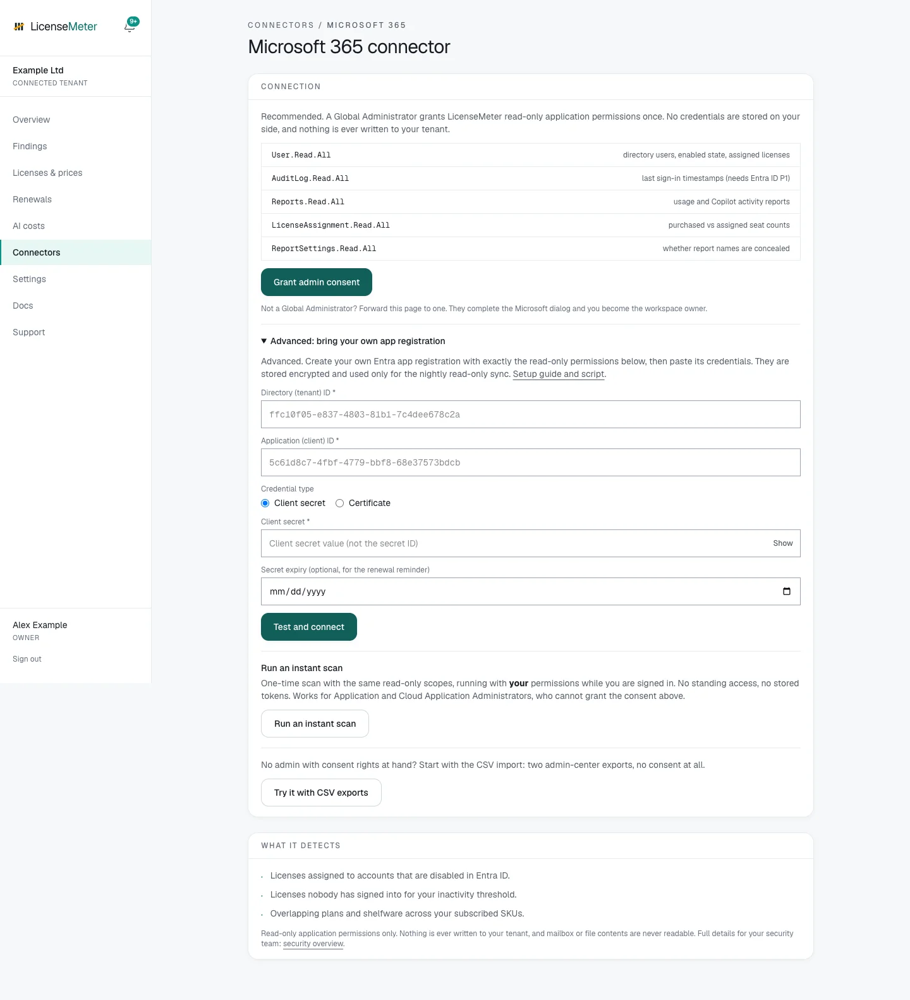

# Connect with your own app

Choose this alternative to managed consent if your organization owns the connector registration and the **Advanced: bring your own app registration** option is available. Do not complete both paths as initial setup steps.

## Prepare the registration

Obtain the **Tenant ID**, **Application (client) ID**, and either a client secret **value** or the matching PEM certificate and private key. The secret ID is not the secret value. The registration needs the exact Microsoft Graph **application** permissions listed on the [Microsoft connector overview](microsoft.md), with administrator consent in the intended tenant.

For registration instructions, see [Microsoft application setup](../self-hosting/microsoft-setup.md). The connector registration is separate from LicenseMeter account sign-in. Creating and consenting a connector app enables tenant-wide read access; it does not change licenses or users. Check your organization's approval process before granting that access.



## Expand Advanced setup

In the intended workspace, open **Connectors > Microsoft 365**, then **Advanced: bring your own app registration**. Enter Tenant ID and Application ID. If Advanced is hidden, the deployment operator has disabled BYO setup.


## Choose the credential type

For **Client secret**, paste the secret value and optionally record its expiry for reminders. For **Certificate**, supply both **Certificate private key (PEM)** and **Certificate (PEM)** matching the public certificate configured on the app registration. Do not upload a binary PFX into a PEM field.

Enter credentials only in the connector form. Do not include them in screenshots, ticket notes, exports or documentation.


## Test and connect

Select **Test and connect**. LicenseMeter attempts app-only authentication, checks the required permission roles and tests reporting access. A missing-permission result shows a checklist and blocks saving until required consent is present. Other reporting limitations can appear as notes and must still be reviewed.

A successful save stores the credential encrypted and starts a sync. It does not guarantee complete report coverage.


## Verify the first refresh

Follow [Verify your first sync](../getting-started/first-sync.md), then [Review your first finding](../getting-started/first-review.md).



<figure><figcaption>
Isolated documentation workspace with fictional data. No live provider connection or customer data is shown.
</figcaption></figure>

## Update credentials or change connection mode

An existing BYO connection shows **Update credentials**. Create the replacement credential, enter it there, select **Test and connect**, and verify a new sync before retiring the old credential. Existing imported data is retained. If the new credential fails, the old valid credential can be restored through the form while it remains valid; a revoked or expired credential cannot be made valid by pasting it again.

A managed connection offers **Switch to your own app registration (Advanced)** when BYO is enabled. Confirm that the registration belongs to the same intended tenant. Switching the credential source preserves the workspace's stored data but changes what future syncs use.

To stop BYO access, disconnect Microsoft and revoke the registration's permissions or credential. First check whether the registration is shared with sign-in or another service. Revocation stops future refreshes; it does not remove existing imported data. Keep a recovery login path before changing a registration used for self-hosted sign-in.

## Common failures

| Result | Check |
| --- | --- |
| Tenant/Application ID must be GUIDs | Copy the directory and application IDs from the registration, not its display name. |
| Authentication failed | Tenant, client ID, secret value or certificate pair, and credential expiry. |
| Missing permissions checklist | Application permissions, admin consent and the correct tenant; delegated permissions do not replace application permissions. |
| Certificate could not be parsed | PEM format, matching key/certificate and valid certificate dates. |
| Tenant belongs to another workspace | Ask its Admin for access instead of creating another binding. |
| Reporting note despite valid roles | Inspect Detection capabilities and Sync history before relying on activity-based findings. |
