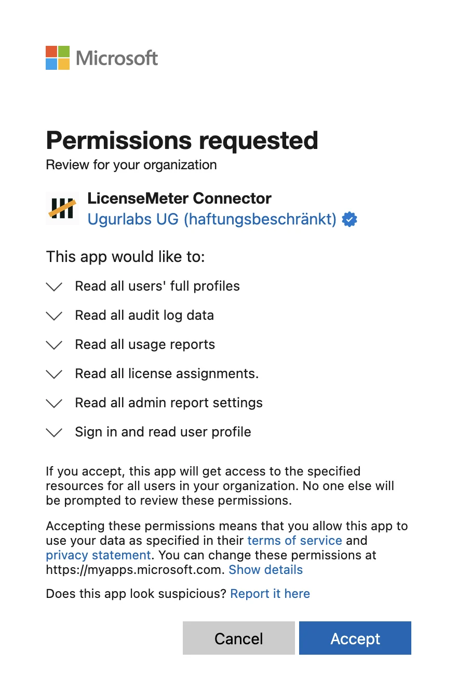

# Connect with managed consent

Use this path when **Grant admin consent** is available. You do not create or paste your own application secret. Microsoft records the permission grant on the LicenseMeter enterprise application in the selected tenant.

## Before granting access

You need Admin or Owner membership in the intended LicenseMeter workspace. The Microsoft approval must be completed by an administrator authorized to grant the requested Graph application permissions, such as a Global Administrator or Privileged Role Administrator. [Microsoft documents the consent roles here](https://learn.microsoft.com/en-us/entra/identity/enterprise-apps/grant-admin-consent).

Consent enables ongoing tenant-wide reads of the [listed directory, license and reporting data](microsoft.md). It grants no connector write permission. To undo future access, disconnect the connector and revoke that application's permissions in Entra. Previously collected data remains until separately deleted.

If another person must approve, coordinate with that administrator and ensure they have the required workspace access before starting their own flow. Do not share your LicenseMeter session or credentials. Confirm the workspace and Microsoft tenant together.



## Open the Microsoft connector

Select **Connectors > Microsoft 365** and confirm the active workspace. Select **Grant admin consent**. If the option is missing, ask the installation operator or use another supported [connection path](microsoft.md).


## Review Microsoft's approval screen

Use the intended administrator account and tenant. Microsoft shows a **Permissions requested** dialog with the subtitle **Review for your organization**. Check these points before accepting, and cancel if any of them differs.

| What to check | Expected on hosted LicenseMeter |
| --- | --- |
| Account at the top | The administrator account of the tenant you intend to connect |
| Application name | **LicenseMeter Connector** |
| Publisher | **Ugurlabs UG (haftungsbeschränkt)** with Microsoft's blue verified badge |
| Permissions | The six lines listed below, all of them read access |

<figure><figcaption>
Microsoft's admin consent dialog for the hosted LicenseMeter Connector. The signed-in account line is removed from this image.
</figcaption></figure>

Microsoft describes each permission in its own words. The lines map to the connector's permissions like this:

| Line in Microsoft's dialog | Permission | Type |
| --- | --- | --- |
| Read all users' full profiles | `User.Read.All` | Application |
| Read all audit log data | `AuditLog.Read.All` | Application |
| Read all usage reports | `Reports.Read.All` | Application |
| Read all license assignments. | `LicenseAssignment.Read.All` | Application |
| Read all admin report settings | `ReportSettings.Read.All` | Application |
| Sign in and read user profile | `User.Read` | Delegated |

The first five are the application permissions the connector registration declares; their purpose is on the [Microsoft connector overview](microsoft.md). Microsoft adds the sixth line to the dialog itself. The connector registration does not declare it, and the connector authenticates as an application without a signed-in user, so it never reads data on behalf of the approving administrator.

A publisher shown as **unverified**, a different application name, or any permission containing **write**, **manage** or mail, file and chat content is not the LicenseMeter connector. Select **Cancel** and contact [Support](https://www.licensemeter.com/support). Expand a line with its arrow to read Microsoft's full description. Select the publisher name to see more about the application: for the hosted connector, the publisher domain is `ugurlabs.com` and the reply URLs include `https://www.licensemeter.com/api/connect/callback`. Its application ID, visible in Entra after consent, is `1a1a346a-05d5-4f54-87a5-5b5e63f9c610`. A self-hosted installation shows the name, publisher and application ID of its operator's own registration instead.

The consent response must return to the initiating flow. A consent link is time-limited; if it expires or has already been used, start again from the connector page.


## Wait for the first sync

LicenseMeter returns to the Microsoft connector with **Tenant connected** and starts the first sync. It can redirect to Overview after either success or a partial run. Follow [Verify your first sync](../getting-started/first-sync.md) before using the totals.


## Establish your baseline

Check Detection capabilities, verify inventory and [enter contract prices](../licenses-and-prices.md). Then follow [Review your first finding](../getting-started/first-review.md). Add other provider connectors after the live Microsoft connection is working.



## Find the grant in Entra afterwards

Accepting creates an enterprise application named **LicenseMeter Connector** in your tenant. In the Microsoft Entra admin center, open **Enterprise applications**, clear the application type filter or search by name or application ID, and open **Permissions**. The **Admin consent** tab lists the five Microsoft Graph application permissions. No client secret or certificate is created in your tenant.

Revoke the permissions there, or delete the enterprise application, to end the connector's access. Account sign-in uses a second enterprise application, **LicenseMeter Sign-in**, described in [Sign in and find your workspace](../getting-started/sign-in.md). Removing the connector does not affect sign-in or instant scans, and removing sign-in does not revoke the connector.

## When consent does not finish

| Message | What to do |
| --- | --- |
| You need to be an admin or owner | Ask the workspace Owner for appropriate access or have an authorized member connect it. |
| Consent declined or incomplete | Review the Microsoft prompt and organization policy with the approving administrator. Retry only when approval is intended. |
| Link expired, already used or invalid | Start again from the connector page, rather than reusing the old Microsoft URL. |
| Tenant already connected to another workspace | Ask that workspace's Admin for an invitation. Do not create a duplicate. |
| Workspace connected to a different tenant | Stop and confirm the active workspace. Do not disconnect an existing tenant just to dismiss the error. |
| Tenant connected but first sync failed | Use the [first-sync recovery steps](../getting-started/first-sync.md); consent success is not proof that reports were collected. |
