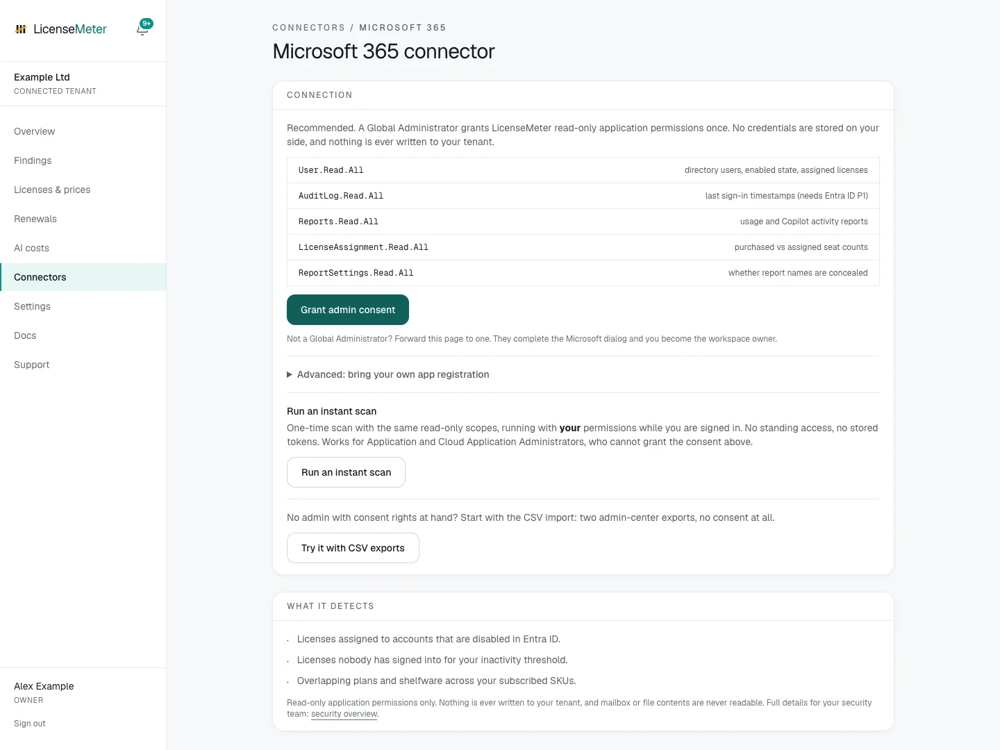

# Microsoft 365

Microsoft 365 provides the directory used to correlate users, licenses and other provider seats. Open **Connectors > Microsoft 365** in the intended workspace. You need LicenseMeter **Admin** or **Owner** to configure a live connection, plus the separate Microsoft authority required by your chosen path.

## Choose one setup path

| Path | Use it when | Continue |
| --- | --- | --- |
| Managed consent | You want a live connection without supplying your own application credential | [Connect with managed consent](microsoft-managed.md) |
| Bring your own registration | Your organization manages the app registration and credential, and the installation exposes this option | [Connect with your own app](microsoft-byo.md) |
| CSV import | You have approved exports and want an assessment without API consent | [Import Microsoft CSV exports](../getting-started/csv-import.md) |
| Instant scan | Your installation offers a delegated, one-time assessment | [Run an instant scan](../getting-started/instant-scan.md) |

Managed and BYO connections provide scheduled and manual refreshes. Snapshot routes require a new import or scan. Additional provider connectors remain unavailable until a live Microsoft connection is established.

<figure><figcaption>
Isolated documentation workspace with fictional data. No live provider connection or customer data is shown.
</figcaption></figure>

This illustration enables all setup options. Your installation may show fewer choices; use the route it supports. A Viewer sees an instruction to ask a workspace Admin instead of setup controls.

## Data used

The live connector reads directory users and assigned licenses, purchased and assigned SKU counts, available sign-in activity, usage and Copilot reports, and report-privacy settings. It does not request mailbox, calendar, Teams message, OneDrive file or SharePoint document content.

| Application permission | Purpose |
| --- | --- |
| User.Read.All | Directory users, enabled state and assigned licenses |
| AuditLog.Read.All | Sign-in timestamps, subject to the tenant's licensing and available signal |
| Reports.Read.All | Usage and Copilot activity reports |
| LicenseAssignment.Read.All | Purchased versus assigned seat counts |
| ReportSettings.Read.All | Whether reports conceal user identities |

These are the live connector's **application** permissions. [Connect with managed consent](microsoft-managed.md) shows how Microsoft words each one in its approval dialog and how to confirm the application's identity. Account sign-in and a delegated instant scan are separate authorization flows. Read access is tenant-wide for the approved data, not limited to the person who signs in.

## Two Microsoft applications

Hosted LicenseMeter uses two separate multi-tenant applications, both published by **Ugurlabs UG (haftungsbeschränkt)** as a Microsoft verified publisher. Each appears as its own enterprise application in your tenant once someone has used it.

| Enterprise application | Application ID | Created when | Access |
| --- | --- | --- | --- |
| LicenseMeter Sign-in | `782cdfc5-6fdb-43a6-85b4-2940baf26ac5` | A person first signs in to LicenseMeter | The signed-in person's name and email address. If someone runs an instant scan, also the delegated read permissions that person approves for the scan |
| LicenseMeter Connector | `1a1a346a-05d5-4f54-87a5-5b5e63f9c610` | An administrator grants managed consent | The tenant-wide read permissions above |

Signing in never grants the connector's access, and connector consent is not needed to sign in. An [instant scan](../getting-started/instant-scan.md) does not use a third application. It asks for delegated read permissions under **LicenseMeter Sign-in**, in a separate dialog that appears only when someone starts a scan. With your own registration or a self-hosted installation, the names and application IDs are those of the registrations your organization created.

## Verify and stop access

Follow [Verify your first sync](../getting-started/first-sync.md) after setup, then [set contract prices](../licenses-and-prices.md). A completed run may still have reporting limitations; see [Report privacy](../troubleshooting/report-privacy.md).

To stop future reads, disconnect Microsoft in LicenseMeter and revoke the application's consent in Entra as appropriate. For BYO, retire its credential only after checking whether anything else uses it. Disconnecting the connector does not erase imported workspace data and stops new syncs that depend on Microsoft. Removing a shared sign-in registration can also block self-hosted login; check that dependency first. Workspace data deletion is a separate destructive action in Settings.
