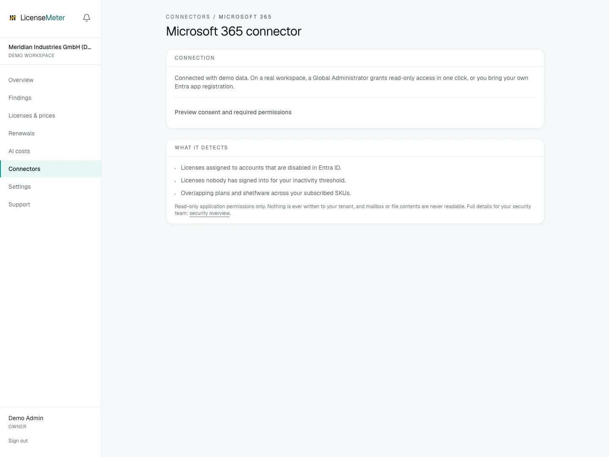

# Microsoft 365

Microsoft 365 is the core directory LicenseMeter reads to find license waste. Most teams use the managed one-click path: a Global Administrator grants read-only application permissions once. If you prefer to own the app registration, the BYO path takes your own Entra app's credentials, stored encrypted and used only for the nightly read-only sync.

Open **Connectors > Microsoft 365** in your workspace.

<figure><figcaption>
LicenseMeter sample workspace. All names, costs and findings shown are demonstration data.
</figcaption></figure>


The screenshot shows sample data, not a live connection or provider consent screen. In your own workspace, the page presents the appropriate connection or import controls.


## Setup



### Managed (recommended): one-click admin consent

On the Microsoft connector page, choose Grant admin consent. A Global Administrator approves LicenseMeter's read-only application permissions for your tenant in the Microsoft dialog. Nothing is stored on your side and nothing is ever written to your tenant. This is the default and needs no app registration.



### Optional: bring your own registration

If the deployment exposes the Advanced / bring-your-own-app option, use an organization-owned application registration and the exact application permissions listed below. Supply the tenant ID, client ID and a client secret, or the supported certificate credentials. Follow your normal approval process for granting tenant-wide read access. Self-hosted registrations are covered in the self-hosting setup guide.

[Grant admin consent to an application](https://learn.microsoft.com/entra/identity/enterprise-apps/grant-admin-consent)



### Verify

On save, LicenseMeter acquires an app-only token and checks the token's roles claim contains every required permission, showing a green/red row per permission and blocking the save if any are missing. It also runs one live call against the usage Reports API. Switching between managed and BYO re-points the sync with no data loss.



## Data used

- Directory users: name, UPN, enabled state and assigned licenses
- Subscribed SKUs: purchased vs assigned seat counts
- Sign-in activity (with Entra ID P1) and usage / Copilot activity reports
- Whether report display names are concealed (a tenant setting)

## Outside this connector's scope

- Mailbox, calendar, Teams, OneDrive or SharePoint content: no content scopes are requested
- Anything writable: every permission is read-only (*.Read.All)

## Findings and limitations

- Licenses assigned to accounts that are disabled in Entra ID.
- Licenses nobody has signed into for your inactivity threshold.
- Overlapping plans and shelfware across your subscribed SKUs.

Managed consent grants ongoing, tenant-wide read access to the listed directory, license and reporting data. It does not grant LicenseMeter write permission. To stop future managed reads, revoke the application permissions for the LicenseMeter enterprise application in Entra and disconnect the integration in LicenseMeter. Revocation stops future refreshes; it does not erase previously imported data. For a registration you own, also revoke its secret or certificate when retiring it.

After setup, check the refresh timestamp and [set contract prices](../licenses-and-prices.md) for any seat-based products. If validation or sync fails, start with [Troubleshooting](../troubleshooting/README.md).

## Application permissions used by the connector

| Permission | Purpose |
| --- | --- |
| `User.Read.All` | directory users, enabled state, assigned licenses |
| `AuditLog.Read.All` | last sign-in timestamps (needs Entra ID P1) |
| `Reports.Read.All` | usage and Copilot activity reports |
| `LicenseAssignment.Read.All` | purchased vs assigned seat counts |
| `ReportSettings.Read.All` | whether report names are concealed |

These are the permissions requested by the application connector. Sign-in and a delegated instant scan have separate authorization flows. Report privacy and source capabilities can still limit the results after consent. See [Report privacy](../troubleshooting/report-privacy.md).
