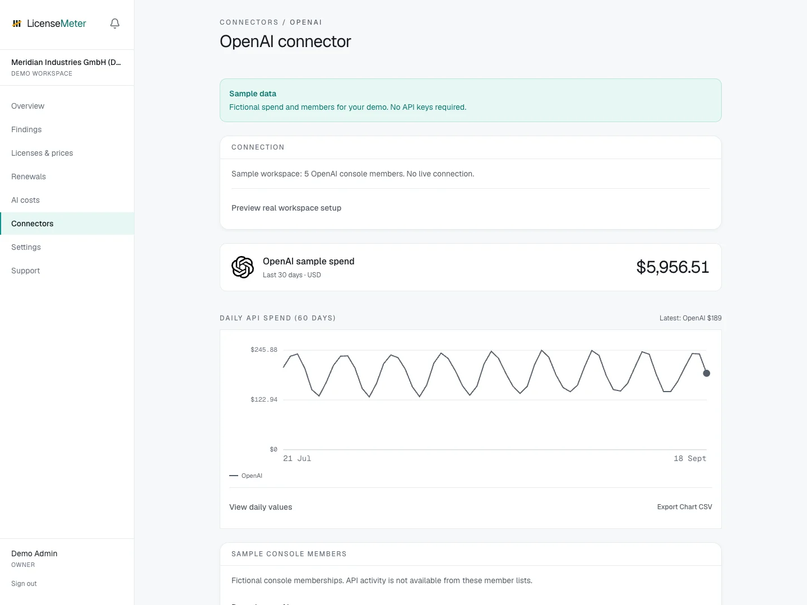

# OpenAI

API spend is invisible until the invoice, and console membership outlives offboarding. With one Admin API key, LicenseMeter backfills up to 180 days of daily cost data and cross-checks every console member against Entra ID.

Open **Connectors > OpenAI** in your workspace.

<figure><figcaption>
LicenseMeter sample workspace. All names, costs and findings shown are demonstration data.
</figcaption></figure>


The screenshot shows sample data, not a live connection or provider consent screen. In your own workspace, the page presents the appropriate connection or import controls.


## Setup



### Create an Admin API key

An Organization Owner opens platform.openai.com under Settings > Organization > Admin keys and creates a key. Only Owners can create admin keys; regular project API keys do not work here.

[OpenAI Admin APIs guide](https://developers.openai.com/api/docs/guides/admin-apis)



### Connect

Paste the key into the single field on the OpenAI connector page. It is validated read-only before storage and encrypted at rest (AES-256-GCM).



### Let the first sync backfill

Up to 180 days of daily cost data and the current console member list arrive with the first sync. Spend appears on the AI costs page in USD, exactly as billed, never converted.



## Data used

- Console organization members: email and name
- Daily cost totals by line item

## Outside this connector's scope

- Prompts, completions or any request content
- Your project API keys' secrets or project data

## Findings and limitations

- Console members whose Entra ID account is disabled: departed people who may still hold live API keys.
- Console members with no matching directory account at all.
- Daily API spend by line item, backfilled on first sync and tracked on the AI costs page.

This connector is for the OpenAI API organization. It does not import ChatGPT subscription seats. Use the separate ChatGPT CSV connector for those.

After setup, check the refresh timestamp and [set contract prices](../licenses-and-prices.md) for any seat-based products. If validation or sync fails, start with [Troubleshooting](../troubleshooting/README.md).
