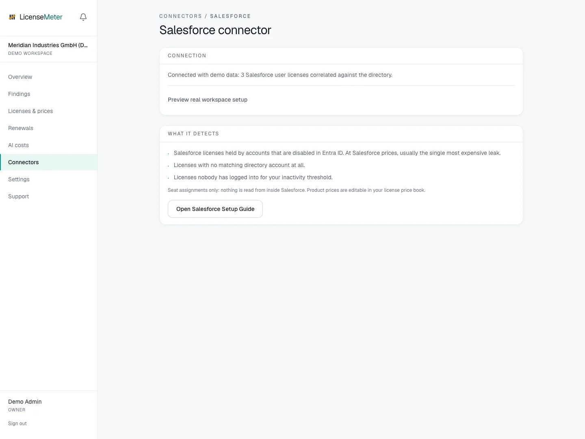

# Salesforce

At Salesforce prices, one forgotten seat pays for a lot of tooling. LicenseMeter queries the user list with license type and last login and cross-checks every license against Entra ID.

Open **Connectors > Salesforce** in your workspace.

<figure><figcaption>
LicenseMeter sample workspace. All names, costs and findings shown are demonstration data.
</figcaption></figure>


The screenshot shows sample data, not a live connection or provider consent screen. In your own workspace, the page presents the appropriate connection or import controls.


## Setup



### Create a Connected App

In Setup > App Manager, create a Connected App with OAuth enabled and Enable Client Credentials Flow checked. Under Selected OAuth Scopes, add 'Manage user data via APIs (api)' - without it the token issues but the user query is rejected, so the connection validates yet reads nothing.

[Salesforce: Configure a Connected App for the Client Credentials Flow](https://help.salesforce.com/s/articleView?id=xcloud.connected_app_client_credentials_setup.htm&type=5)



### Set a read-only run-as user

Under Manage > Edit Policies > Client Credentials Flow, set the execution user. Use a dedicated integration user with API Enabled and View All Users (read-only) - View All Users is what lets the single query return every active user when User Sharing is on; without it the list comes back empty or partial. LicenseMeter's only query is the user list.



### Connect

Paste your production My Domain URL (https://<org>.my.salesforce.com) or sandbox My Domain URL (https://<org>.sandbox.my.salesforce.com), plus the consumer key and consumer secret, on the Salesforce connector page. Validated before storage, encrypted at rest.



## Data used

- The user list: email, name, active flag and license type
- Last login per user

## Outside this connector's scope

- CRM records: no accounts, contacts, opportunities or reports

## Findings and limitations

- Salesforce licenses held by accounts that are disabled in Entra ID. At Salesforce prices, usually the single most expensive leak.
- Licenses with no matching directory account at all.
- Licenses nobody has logged into for your inactivity threshold.

The OAuth api scope can cover more than the user query LicenseMeter performs. Restrict the dedicated execution user and review the granted access in Salesforce. Organizations that cannot create legacy Connected Apps should follow Salesforce’s current application setup path with the required client-credentials capability.

After setup, check the refresh timestamp and [set contract prices](../licenses-and-prices.md) for any seat-based products. If validation or sync fails, start with [Troubleshooting](../troubleshooting/README.md).
