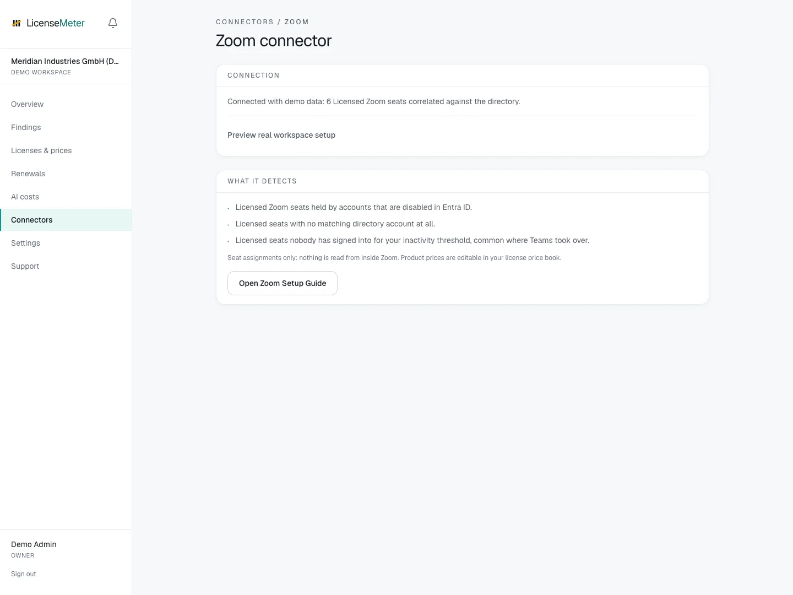

# Zoom

Zoom licenses linger after Teams takes over and after people leave. LicenseMeter lists licensed users and their last login and cross-checks each seat against Entra ID.

Open **Connectors > Zoom** in your workspace.

<figure><figcaption>
LicenseMeter sample workspace. All names, costs and findings shown are demonstration data.
</figcaption></figure>


The screenshot shows sample data, not a live connection or provider consent screen. In your own workspace, the page presents the appropriate connection or import controls.


## Setup



### Create the Server-to-Server OAuth app

In the Zoom App Marketplace under Develop > Build App, a Zoom account admin creates a Server-to-Server OAuth app and activates it. The app stays internal to your account. Nothing is published.

[Zoom Server-to-Server OAuth guide](https://developers.zoom.us/docs/internal-apps/s2s-oauth/)



### Grant the scope

Add the user:read:list_users:admin scope (the granular scope that lists all users). Nothing else is required. Note that the similarly named user:read:user:admin reads only one user at a time and will not authorize the sync.



### Connect

Copy the account ID, client ID and client secret from the app credentials page and paste them on the Zoom connector page. They are validated before storage and encrypted at rest.



## Data used

- Licensed users: email, name, status and plan type
- Last sign-in where Zoom reports it

## Outside this connector's scope

- Meetings, recordings, chat or any content

## Findings and limitations

- Licensed Zoom seats held by accounts that are disabled in Entra ID.
- Licensed seats with no matching directory account at all.
- Licensed seats nobody has signed into for your inactivity threshold, common where Teams took over.

The connector needs the list-users permission. A single-user read scope does not authorize an organization-wide member sync.

After setup, check the refresh timestamp and [set contract prices](../licenses-and-prices.md) for any seat-based products. If validation or sync fails, start with [Troubleshooting](../troubleshooting/README.md).
