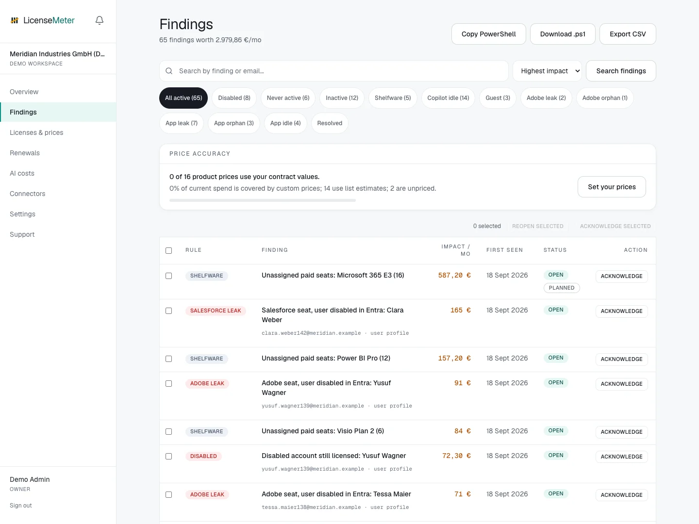

# Review findings

A finding is a reason to investigate an account, license or subscription. It is not an instruction to remove access automatically.

<figure><figcaption>
LicenseMeter sample workspace. All names, costs and findings shown are demonstration data.
</figcaption></figure>



## Choose a review candidate

Open **Findings**. Use the available filters and search to narrow the list, then prioritize by monthly impact, offboarding risk or an upcoming renewal. Check data freshness and contract-price coverage first.


## Read the evidence

Open the finding and inspect **Finding details**. Follow the user profile link when present to see related findings for the same person. Several findings can describe the same person or related entitlements; review them together before quoting a combined savings figure.


## Confirm the business context

Check whether the account is intentionally retained, the person is on leave, access is needed for another role, or the product is covered by a fixed contract. Missing activity is only as reliable as the reports available to the connector.


## Record the decision

An Admin can acknowledge a finding, assign a workflow owner, add a due date and link an external ticket. Perform any approved license change through the provider's administration tools, then refresh LicenseMeter to verify the result.




Acknowledging a finding records review. It does not remove a license, resolve the detection condition or count as verified savings.


Continue with [Detection rules](rules.md) and [Remediation workflow](workflow.md).
