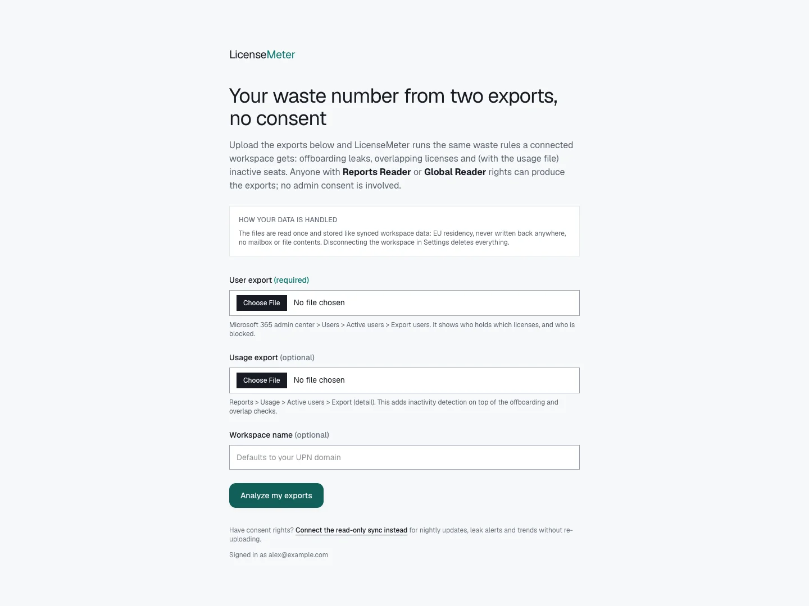
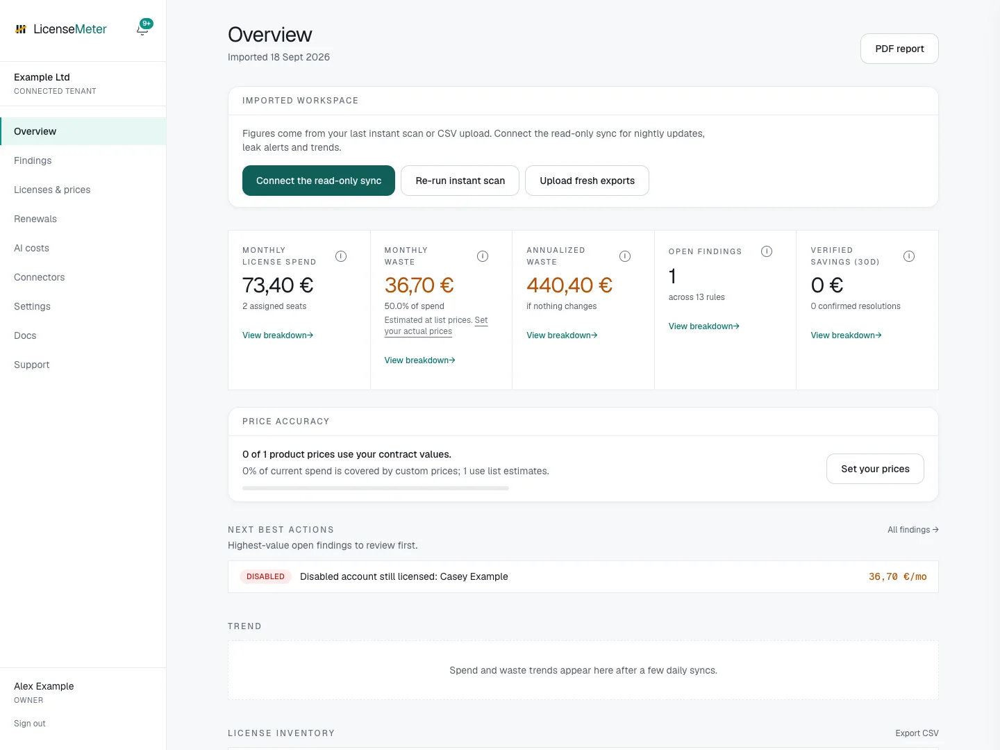

# Import Microsoft CSV exports

Use CSV import when you have admin-center exports but are not ready to grant a live connector access. This creates a snapshot, not a continuously refreshed connection. Sign in to your own workspace first; imports are unavailable in the sample workspace. A LicenseMeter account does not by itself give you permission to export Microsoft data. Obtain authorized exports from your organization.



## Prepare the user export

In the Microsoft 365 admin center, export users from **Users > Active users**. Keep the header row. Each input file must be 5 MB or smaller. This is the required file and identifies users, assigned licenses and blocked accounts.


## Add a usage export if available

Export the detailed **Reports > Usage > Active users** report. This optional file supplies activity dates. Without identifiable activity data, the import cannot support the same inactivity conclusions as a complete live connection.


## Import and analyze

In the empty workspace, select **No Microsoft admin access?**, or choose **Try it with CSV exports** on the Microsoft connector page. Select **User export**, optionally select **Usage export**, and set a workspace name if desired. Select **Analyze my exports**.


## Review coverage and prices

On completion, LicenseMeter opens Overview. Check the workspace name, resulting findings and [first-review checklist](first-review.md), then set [contract prices](../licenses-and-prices.md). Review the date and scope of your exports before comparing results over time.



Do not rename or remove identifying columns. If the import fails, use a fresh export and read the validation message. Concealed user names can prevent user-level matching; see [report privacy and detection coverage](../troubleshooting/report-privacy.md).

The ChatGPT and Claude connector imports are different: those accept a pasted member table on their respective connector pages. See [ChatGPT](../connectors/chatgpt.md) and [Claude](../connectors/claude.md).

## What the import can establish

The user file supplies assignments and blocked-account information. The optional usage file adds available activity dates. These exports do not establish the number of purchased seats, so CSV imports do not calculate unused purchased-seat shelfware from a guessed quantity. They also do not supply the full sign-in or Copilot coverage of every live source.

CSV-only workspaces do not unlock the other provider connectors. Complete a managed or BYO Microsoft connection for continuous monitoring and those connectors.

<figure><figcaption>
Local documentation workspace with a fictional signed-in identity.
</figcaption></figure>

## Practice with a small fictional file

[Download the example users CSV](../.gitbook/assets/example-users.csv) to try the import in a **dedicated test workspace**. It contains only fictional example.com identities and is not an export from Microsoft. Do not import it into an existing organizational assessment: importing again replaces the stored user and SKU snapshot.

<figure><figcaption>
Actual result of importing the documentation CSV in an isolated test workspace. Values are illustrative estimates.
</figcaption></figure>

## Refresh or upgrade the assessment

An Admin or Owner can re-upload current exports. This replaces the imported users and SKU inventory while retaining edited contract prices. Keep the previous authorized export if you need to restore that snapshot by re-importing it. Old and new imports should cover the same intended population to avoid mistaking omitted rows for completed remediation.

The hosted import flow chooses an existing non-connected workspace owned by the signed-in identity when available; the Entra flow uses the sign-in tenant. Always check the resulting workspace name, especially if you can access multiple workspaces. Do not assume the active switcher selection alone determines an import's destination.

To move to live data, open Microsoft in the intended imported workspace and complete managed or BYO setup. The live sync replaces the imported directory rows with provider data. Verify the next sync and prices before comparing the new baseline.

## Resolve import problems

| Problem | Next action |
| --- | --- |
| File exceeds 5 MB | Use the live connector for a larger assessment; do not silently omit users to make a complete report appear smaller. |
| Expected headers are missing | Read the validation message and use the actual admin-center CSV with its identifying columns intact. |
| Usage report cannot match users | Check report privacy, or omit the optional usage file and record the reduced activity coverage. Do not change tenant-wide report privacy without reviewing its impact. |
| Workspace already connected | Use its live connection and sync instead of overwriting it with CSV. |
| View-only role | Ask a workspace Admin to refresh the import. |
| Too many uploads | Wait before retrying; imports are limited to ten per hour for the relevant account or organization. |

Next: [Review your first finding](first-review.md).
