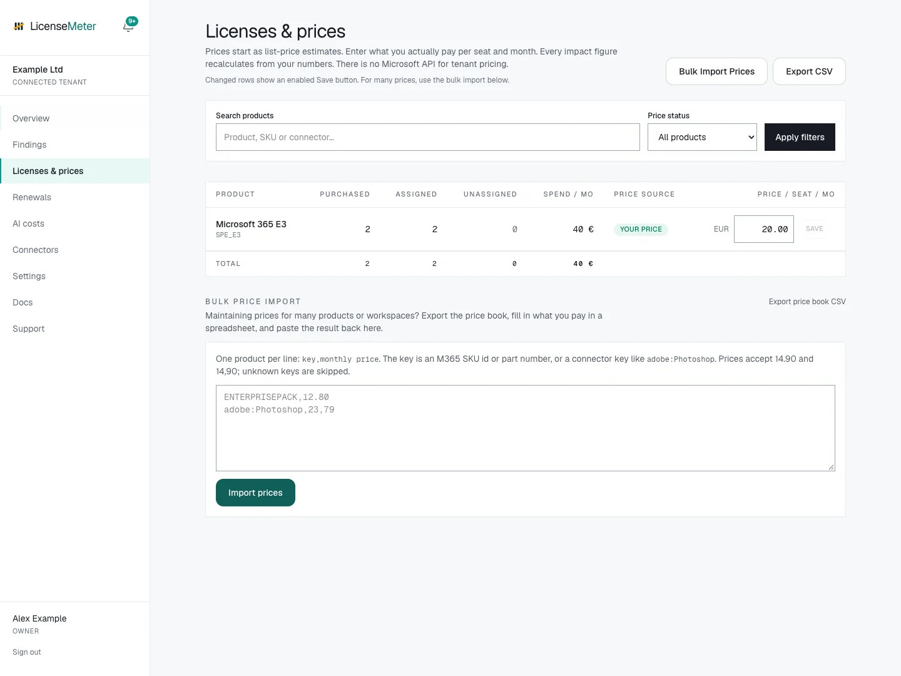
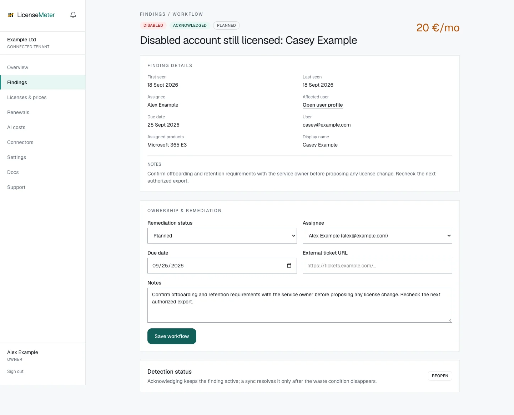

# Review your first finding

Your first useful outcome is a reviewed opportunity with a known data and price basis. You do not need to remove a license to complete this walkthrough. Use a workspace with data and an Admin or Owner role if you want to save prices or workflow changes. A Viewer can inspect and export; ask an Admin to make changes.



## Check the data first

Complete [Verify your first sync](first-sync.md). For imported data, check when the source export was produced and which activity columns were included. Write down any coverage limitation you need to explain in the report.


## Enter one contract price

Open **Licenses & prices**, find an assigned product and enter its monthly price per seat in the workspace's currency. Select **Save** and check the saved result. Match the exact SKU or product, not just a similar display name.

For example, an annual contract of EUR 240 per seat has a monthly equivalent of EUR 20 per seat. This is an illustrative calculation, not a LicenseMeter price recommendation. Saving it changes LicenseMeter's estimates only; it does not change the vendor agreement. Record the previous price if you may need to restore it.

Return to Overview and check **Price accuracy**. One priced product does not make the whole workspace fully priced.

<figure><figcaption>
Fictional example assessment after saving a contract-price example. This is not a vendor price quotation.
</figcaption></figure>


## Choose a finding and read the evidence

Open **Findings**, or choose an item from **Next best actions**. Open **Finding details** and check the rule, affected user or product, activity information and price basis. Follow the user link if you need to review related findings together.

For a disabled account that still holds a license, confirm that the account is intentionally disabled and whether retention or other services still require the license. Do not add overlapping findings together as though they were independent savings.


## Record the next action

An Admin can set a remediation status, assign a workspace member, add a due date, ticket URL and notes, then select **Save workflow**. Acknowledge the finding after review if appropriate. Acknowledgement does not remove the license or resolve the finding.

A useful note records the evidence, who will decide, what must be checked before a provider-side change and when to review again. The [workflow guide](../findings/workflow.md) explains the statuses.

<figure><figcaption>
Saved review in the isolated documentation workspace. The finding remains active and no provider-side change has been performed.
</figcaption></figure>


## Share a report

Return to Overview and select **PDF report**, or export findings from the findings page. Check the workspace, date, currency, price coverage and personal information before sharing. Explain that the amount is an opportunity estimate, with the limitations you recorded in step 1.


## Verify any later action

If the organization later approves and performs a change in its provider administration tools, run a fresh sync or re-import the snapshot. LicenseMeter resolves the finding when its detection condition disappears. A workflow status alone does not verify the outcome, and billing savings still depend on the contract.



## Completion checklist

- The source and its limitations are known.
- The selected product's price matches the contract basis.
- The finding has been reviewed in context.
- A responsible person and next step are recorded, or the review is explicitly complete with no change needed.
- The report identifies estimates and the intended audience.

If there are no findings, still complete the coverage and price checks. An empty result can mean there is nothing detected, or that the available source cannot support particular rules.

Next: [Invite your team](../workspace/members.md), add [other providers](../connectors/README.md) to a live workspace, or plan a [renewal review](../renewals.md).
