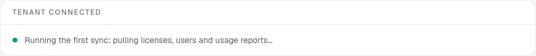
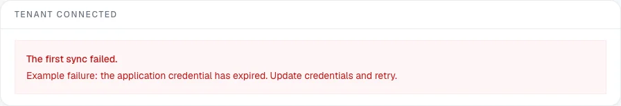

# Verify your first sync

A saved connection or accepted consent confirms access setup. It does not prove that all reports were collected. Use this checklist before treating the dashboard as your organization's baseline.

## What happens after connecting

After managed Microsoft consent, LicenseMeter returns to the connector page with a **Tenant connected** card and **Running the first sync: pulling licenses, users and usage reports…**. The first sync starts automatically. BYO setup also starts a sync after a successful connection test.

<figure><figcaption>
Actual application component with a simulated running response in an isolated documentation workspace.
</figcaption></figure>

The screen checks for progress while you wait. Both a successful run and a **partial** run can redirect you to Overview. If it shows **This is taking longer than expected**, use **Refresh this page** or return later. This message appears after about three minutes of polling; it is not proof that the server stopped the sync. Avoid repeatedly reconnecting the tenant.

## Check the result



## Confirm the organization and source

Check the active workspace and the Microsoft tenant on its connector page. For CSV or instant scan, confirm the imported assessment is the one you intended to review. An import is not a nightly connection.


## Inspect Sync history

For a live connection, open **Settings > Sync history**. Check the newest run and expand its details where available. **Success** means the run completed; **partial** means some source steps did not complete; **failed** needs investigation before relying on fresh results. Read the step-level messages, especially when adding multiple providers.


## Review Detection capabilities

In **Settings**, inspect sign-in activity, usage-report identity coverage and Copilot coverage. A completed run can still lack a capability because of report privacy, licensing or provider data availability. Use [Report privacy and detection coverage](../troubleshooting/report-privacy.md) for the implications.


## Sanity-check inventory and freshness

Open **Licenses & prices**. Confirm that expected products and assigned users are represented, then check **Last synced** on Overview. Compare a small authorized sample with your source records. Zero findings or a recent timestamp alone does not establish completeness.


## Record limitations and set prices

Note missing providers, incomplete activity coverage and unpriced products before exporting a report. Follow [Review your first finding](first-review.md) to replace estimates with contract prices and inspect one candidate.



## Recover when the first sync fails

<figure><figcaption>
Actual application component with a simulated failure and illustrative error text. No live provider connection was attempted.
</figcaption></figure>

| Result | What to do |
| --- | --- |
| **The first sync failed** | Read the displayed error and Sync history. Fix the specific permission or credential issue before retrying. |
| Missing application permission | Have the registration's administrator correct and consent to the required permission. Re-test BYO credentials, then sync again. |
| Expired credential | Replace the secret or certificate through **Update credentials**. Verify a completed refresh before retiring the previous credential. |
| Provider throttling or temporary outage | Check the service status and retry later. Recreating the workspace does not solve a provider outage. |
| Partial run | Review the failed steps. Do not describe affected providers as fully assessed until their data refreshes successfully. |
| No run appears after consent | Refresh the connector page, check Sync history, and use **Sync now** if available to an Admin or Owner. Contact support if the run never starts. |
| CSV or one-time scan | Refresh through the original import or scan path. A snapshot does not become scheduled monitoring automatically. |

**Sync now** refreshes all connected services in the workspace, not just the provider page you clicked from. Scheduled live sync runs daily at 03:00 UTC on the hosted service; self-hosted operators must configure the scheduler.

For support, include the provider, approximate time, displayed error and whether the run was partial or failed. Never send tokens, secrets or unredacted personal data.
