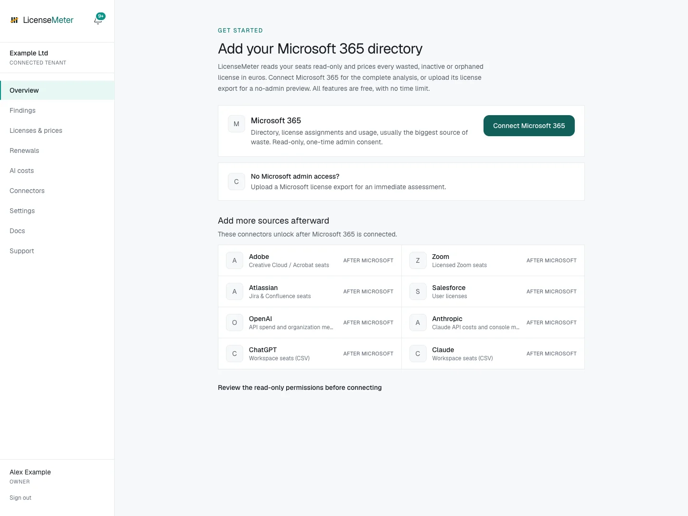

# Sign in and find your workspace

Use the Microsoft work or school account you intend to use for LicenseMeter membership. Signing in and granting connector consent serve different purposes, even when the same account does both.




## Leave the sample workspace if necessary

If the sidebar identifies a **Demo workspace**, select **Sign out**. Demo users cannot save prices, connect providers or accept an invitation into a real workspace.



## Open sign-in

Open [LicenseMeter](https://www.licensemeter.com/) and select **Start free**, then the sign-in action in that area. You can also open the [sign-in page](https://www.licensemeter.com/sign-in) directly.

Sign-in is Microsoft only: select the Microsoft button and sign in with your work or school account. Personal Microsoft accounts are not accepted. Complete whatever password and multi-factor steps your organization requires; those happen at Microsoft, and LicenseMeter never sees them.

Signing in asks only for your basic profile: your name, username and email address, together with the IDs of your account and your organization. It reads nothing in your organization's Microsoft 365 and normally needs no administrator rights. If Microsoft shows **Need admin approval**, your organization does not let people approve apps themselves: ask an administrator to approve the LicenseMeter sign-in, which covers the basic profile only. Connecting Microsoft 365 for the license data is a separate, later step: a second Microsoft dialog for a separate app, LicenseMeter Connector, that a Global Administrator or Privileged Role Administrator approves.

Use the invited work account for an invitation. Do not assume that two accounts reach the same workspace, even when they share an email address. LicenseMeter recognizes you by your Microsoft account, not by the address you type.

If you see **Request scan access** rather than a working sign-in action, use [Support](https://www.licensemeter.com/support) or contact your installation's operator. The sample workspace remains a way to explore. Do not grant Microsoft consent to solve a missing LicenseMeter login option.



## Identify which workspace you entered

Sign-in resolves invitations and existing memberships first. For a new account, an email that Microsoft marks as verified for your company's domain may join an existing workspace or request approval according to its owner's settings. If it does not join, the account gets its own empty workspace.

| What you see                                              | Meaning                                                                                                | Next step                                                                              |
| --------------------------------------------------------- | ------------------------------------------------------------------------------------------------------ | -------------------------------------------------------------------------------------- |
| Your organization's populated dashboard                   | You have membership and it already contains data                                                       | Check your role, freshness and prices before reviewing findings                        |
| **Add your Microsoft 365 directory**                      | The active workspace has no Microsoft assessment yet                                                   | Connect Microsoft or import authorized exports                                         |
| **You asked to join… An admin there needs to approve it** | Your access request is pending                                                                         | Ask that workspace's Admin or Owner to review **Settings > Members > Access requests** |
| An unfamiliar or empty workspace despite an invitation    | You may be signed in with another account, the invite may have expired, or another workspace is active | Check the account, switch workspace, or ask for **Resend**                             |

While approval is pending, your own workspace does not contain the other workspace's organizational data. Dismissing the notice only hides it in that browser; it does not cancel or approve the request. After approval, refresh and use the workspace switcher when available.



## Check the workspace name and role

On desktop, the workspace is in the sidebar. On mobile, open the menu. The switcher appears when you can access more than one workspace; your role applies separately in each. Viewer access is enough for reports, but a workspace Admin or Owner must maintain the connection and prices.



<figure><figcaption>
Isolated LicenseMeter documentation workspace with fictional data. No live provider connection or customer data is shown.
</figcaption></figure>

The sidebar's **Connected tenant** label identifies a non-demo workspace; it is not proof that a provider connection or first sync has succeeded. Use the connector status and [first-sync checklist](first-sync.md) to verify that.

## If a colleague invited you

Invitations expire after **14 days** if unclaimed. Ask an authorized member to use **Settings > Members > Resend** for an expired invitation. Resending restarts the expiry period. Where invitation email is unavailable, sign in to the same installation with the exact invited work account. The [membership guide](../workspace/members.md) explains administrator actions and domain-join options.

Next: [Choose the Microsoft connection path](../connectors/microsoft.md), or [review existing data](first-sync.md).
