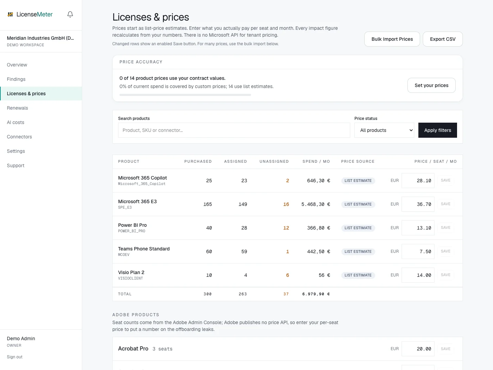

# Licenses and prices

Open **Licenses & prices** to inspect your inventory and maintain the workspace's price book. Contract prices make estimated waste relevant to your agreement.

<figure><figcaption>
LicenseMeter sample workspace. All names, costs and findings shown are demonstration data.
</figcaption></figure>



## Identify the product

Match the product in the inventory to the exact item in your contract. Microsoft products use SKU identifiers; other providers use their own product keys. Similar product names do not always mean identical entitlements.


## Enter a monthly per-seat price

Use the contracted monthly equivalent for one seat, in the workspace's selected currency. If your agreement is annual, calculate a consistent monthly equivalent before entering it. Saving a price updates estimates inside LicenseMeter; it does not change vendor billing.


## Check price accuracy

Return to **Overview** and inspect **Price accuracy**. Review both how many products use custom prices and how much spend those prices cover. Unpriced products can produce an understated total.



## Bulk prices and exports

Use the price import controls for a larger price book. Start from the exported price book so product keys align with the workspace inventory. Inspect unmatched keys and validation messages before assuming every price was applied.

API spending from OpenAI and Anthropic is reported separately in USD. A ChatGPT or Claude subscription seat uses a price-book entry, while API usage uses provider cost data. See [AI costs](ai-costs.md).


An opportunity estimate is not a guaranteed refund. Purchased commitments, renewal dates, minimum quantities and discounts determine what your organization can actually save.

