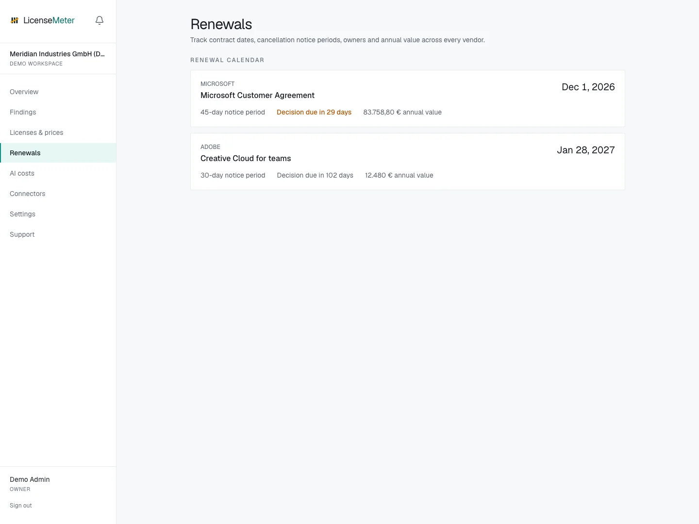

# Renewal calendar

Use **Renewals** to record a vendor contract and its decision window. This connects license review to the date when you can change a commitment.

<figure><figcaption>
LicenseMeter sample workspace. All names, costs and findings shown are demonstration data.
</figcaption></figure>



## Record the agreement

An Admin or Owner opens **Renewals** and adds the vendor, contract details, renewal date, notice period and annual value where available. Use the actual agreement as the source.


## Work from the notice deadline

The notice period determines how far ahead you need to act. Check the displayed decision deadline rather than assuming the renewal date is the last day you can reduce or cancel seats.


## Review open findings

Use the renewal window on Overview to investigate affected products and accounts. Validate business need and prices, then take any procurement decision through the vendor or reseller.



Saving or editing a renewal in LicenseMeter is a planning action. It does not submit cancellation, notify a vendor or modify the underlying contract. Confirm terms and deadlines with your agreement owner.

The sample calendar contains fictional contracts. Use it to learn the workflow before adding your own dates.
