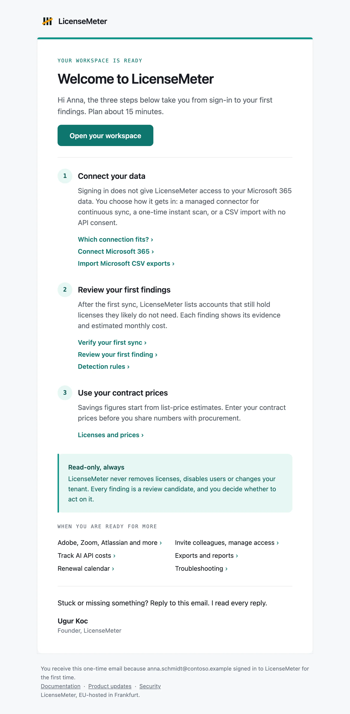
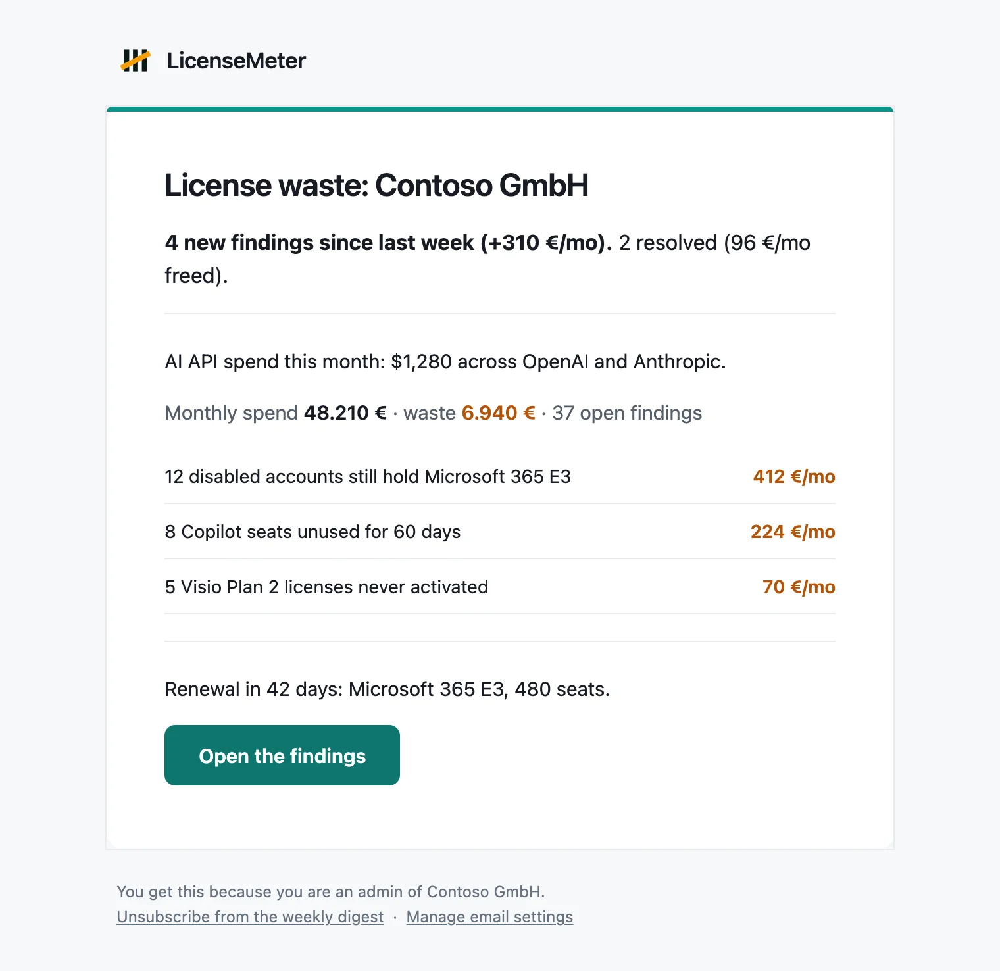
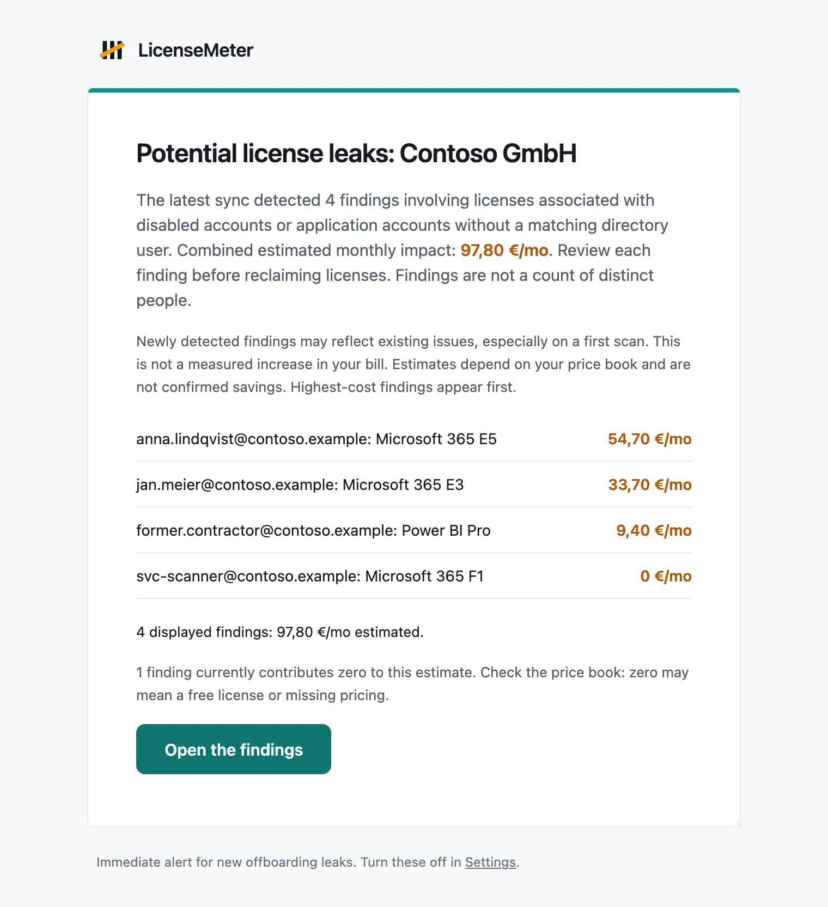
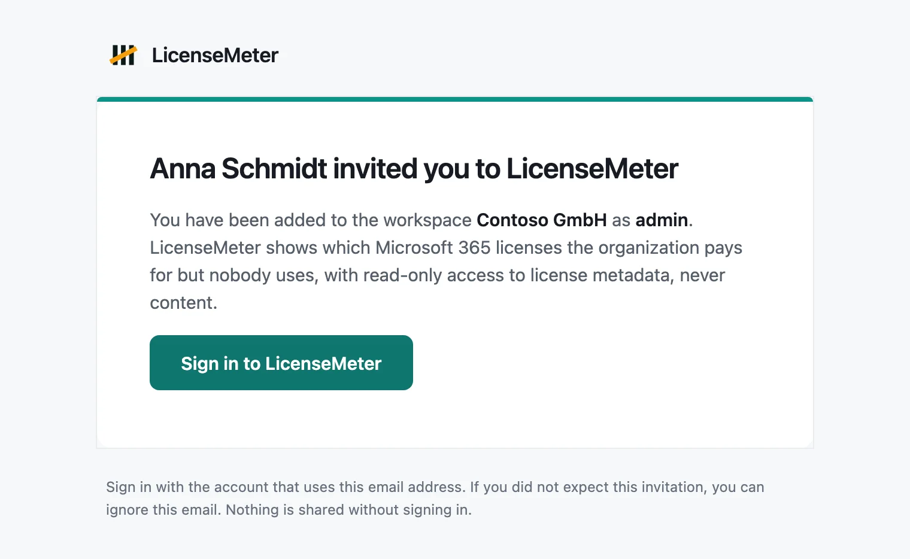

# Emails from LicenseMeter

LicenseMeter sends a small number of emails. Each one has a single purpose, and none of them contains anything you cannot also see in your workspace. This page shows the four you will meet most often and lists the rest.

Buttons in these emails take you to the page they are about. If you are signed out, you sign in first and then land there.


The examples below use a fictional organization. Names, addresses, costs and findings are demonstration data.


## Welcome

Sent once, when your first sign-in creates your own workspace. It walks you through three steps: connecting your data, reviewing your first findings and entering your contract prices. Each step links the guide that covers it.

<figure><figcaption>
Example with fictional data.
</figcaption></figure>

| Detail | Description |
| --- | --- |
| Subject | Welcome to LicenseMeter: your first 15 minutes |
| Sent to | The person whose sign-in created the workspace, at the address Microsoft confirmed for them |
| Not sent to | Colleagues who join an existing workspace, the sample workspace, and self-hosted installations |
| How often | Once. There is nothing to unsubscribe from |

Replies to this email reach the LicenseMeter team.

## Weekly digest

A Monday summary of what changed. It leads with the findings that are new since last week and the ones that were resolved, then shows your monthly spend, the estimated waste, the number of open findings and the most expensive ones. When a renewal is near or your workspace tracks AI API costs, it adds one line for each.

<figure><figcaption>
Example with fictional data.
</figcaption></figure>

| Detail | Description |
| --- | --- |
| Subject | Starts with "LicenseMeter:" and names your workspace |
| Sent to | Every Owner and Admin of the workspace, each with their own copy |
| When | Mondays at 06:00 UTC |
| Turn it off | **Settings**, under **Email me**, or the unsubscribe link at the bottom of the email |

Turning the digest off is personal. It affects only you and only that workspace. Other Admins decide for themselves.

A workspace with no open findings does not go silent. If it synced within the last eight days, the digest is replaced by a short all-clear that also names what was resolved during the week.

## Leak alert

Sent right after a sync that detects new offboarding leaks: licenses that are still paid for although the account was disabled, or although no matching directory user exists. These findings cost money every month until someone acts, so they do not wait for the Monday digest.

The email lists the ten most expensive findings first. It then states the subtotal of the listed findings, the subtotal of any further findings, and how many findings add nothing to the estimate because the license is free or has no price yet. The listed and further subtotals always add up to the headline figure.

<figure><figcaption>
Example with fictional data.
</figcaption></figure>

| Detail | Description |
| --- | --- |
| Subject | Names the number of potential license leaks, your workspace and the estimated monthly impact |
| Sent to | Every Owner and Admin of the workspace |
| When | After a sync that finds new leaks. The scheduled sync runs daily at 03:00 UTC |
| Turn it off | **Settings**, **Leak alert emails**. This switch applies to the whole workspace |


The figure is an estimate from your price book, not a measured increase in your bill. A first sync often reports leaks that have existed for months. A finding is a license to review, not a count of people. Check each one before you reclaim a license, and enter your contract prices under [Licenses and prices](../licenses-and-prices.md) so the estimate reflects what you pay.


See [Detection rules](../findings/rules.md) for what counts as a leak and [Remediation workflow](../findings/workflow.md) for what to do next.

## Invitation

Sent when an Owner or Admin invites you under **Settings**, **Members**. It names the person who invited you, the workspace and your role.

<figure><figcaption>
Example with fictional data.
</figcaption></figure>

| Detail | Description |
| --- | --- |
| Subject | Names the person who invited you and the workspace |
| Sent to | The address the inviter entered |
| Valid for | 14 days. **Resend** in Members restarts that period |
| What to do | Sign in with the Microsoft work or school account that uses this address |

Nothing is shared until you sign in. If you did not expect the invitation, ignore it. If signing in does not open the workspace, see [Invite colleagues and manage access](members.md).

## Other emails

| Email | Sent to | When |
| --- | --- | --- |
| Monthly report | Owners and Admins who have not turned it off | On the 1st of the month at 07:00 UTC, with the PDF report attached, when the workspace has the monthly report enabled in **Settings** |
| All clear | Owners and Admins who receive the digest | In place of the weekly digest when no findings are open |
| Access request | Owners and Admins | A colleague with a verified company address asked to join the workspace |
| Colleague joined | Owners and Admins | A colleague joined automatically because the workspace allows it |
| Access approved | The person who asked | An Owner or Admin approved their request |
| Confirm your account | The address of an existing membership | Someone signed in and asked to open the workspaces that belong to this address. The link works once and for a limited time |
| Workspace deleted | The remaining Owners and Admins | A workspace was deleted. This notice cannot be turned off |

## If an email does not arrive

- Check the spam folder and any quarantine your organization runs, then allow the sender.
- Confirm the address. LicenseMeter writes to the address of your membership, shown under **Settings**, **Email me**.
- Only Owners and Admins receive the digest, the report and leak alerts. Viewers do not.
- The digest and the report respect your personal switch, and leak alerts respect the workspace switch.
- The sample workspace never sends email.

On a self-hosted installation, email works only when the operator has configured a mail service and the scheduler is running. See [Self-hosting with Docker](../self-hosting/README.md).
