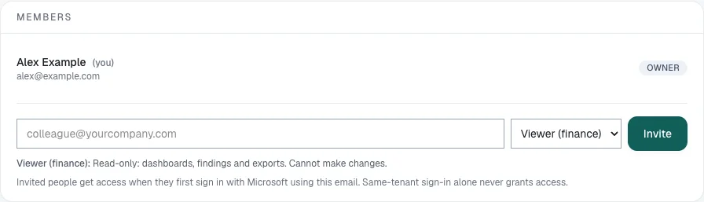
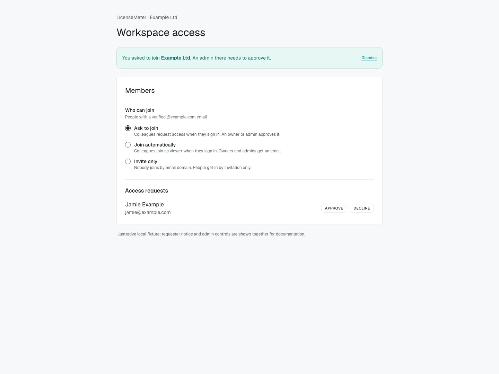

# Invite colleagues and manage access

Open **Settings > Members** in the intended workspace. Admins can manage ordinary memberships and access requests; Owners can also manage Owner access and the **Who can join** policy. A person's role is local to this workspace, not a Microsoft administrator role.

## Invite a colleague




## Choose the workspace and identity

Check the workspace name, then obtain the exact email the colleague will use to sign in. An invitation grants access to the workspace's organization data, so confirm the recipient before sending.



## Select a role and invite

Enter the address, choose **Viewer (finance)** for read-only reporting or **Admin** for maintenance, then select **Invite**. Owners can grant **Owner** when that responsibility is intended. Confirm the success message and the new membership row.



## Have the colleague sign in

Where email delivery is configured, the colleague receives a sign-in link. Otherwise, direct them to the installation's sign-in page. They sign in with the Microsoft work or school account that belongs to the invited address. If Microsoft does not confirm that address at sign-in, LicenseMeter emails a claim link to it, and opening that link while signed in completes the match.

The invite expires after **14 days** while unclaimed. **Resend** restarts that period. If the person already signed in, have them refresh and check the workspace switcher.



## Verify access together

Ask the person to confirm the workspace name and visible role. A Viewer should be able to inspect reports without editing connector credentials or prices. If an invitation seems missing, check the sign-in address and expiry before granting broader access.



<figure><figcaption>
Isolated documentation workspace with fictional data. No live provider connection or customer data is shown.
</figcaption></figure>

## Approve a company-domain request

Eligible colleagues whose Microsoft sign-in carries a verified company email can be matched to the workspace associated with that domain. This is governed by **Who can join**; it is not unrestricted access for everyone using Microsoft sign-in. Public email providers are not treated as a shared company domain.

When a request is pending, an Admin or Owner opens **Settings > Members > Access requests**, checks the identity and selects **Approve** or **Decline**. Approval grants **Viewer** access. Raise the role separately only when needed. The requester can continue in their own workspace while waiting; that does not give them access to yours.

<figure><figcaption>
Illustrative local fixture using the application's actual components. Requester and administrator states are shown together for explanation; they normally appear to different people. No request was sent.
</figcaption></figure>

## Choose who can join

| Setting                | Effect on eligible new colleagues                                   |
| ---------------------- | ------------------------------------------------------------------- |
| **Ask to join**        | Creates an access request for an Admin or Owner to review.          |
| **Join automatically** | Grants Viewer membership on qualifying first sign-in.               |
| **Invite only**        | Does not grant access by company domain; an invitation is required. |

Only an Owner can change this setting. It appears for the workspace that holds an eligible company domain, not for every workspace. If absent, use invitations. On a self-hosted installation, domain join only works once the sign-in app registration releases the verified email claim; see [Microsoft application setup](../self-hosting/microsoft-setup.md).

**Join automatically** exposes this workspace's readable organizational data to eligible colleagues. To stop future automatic joins, restore **Ask to join** or **Invite only**. That change does not remove existing members; review those memberships separately.

## Change or remove a member

Use the member's role selector and verify the saved result. To remove access, select **Remove**, then **Confirm remove**. Check the target before confirming. Removal affects this workspace's access, not the person's provider account or licenses. Re-invite the correct identity with the intended role to restore membership if necessary.

Keep an accessible Owner account before reducing Owner access. The application protects the last Owner from removal or demotion. Maintain a second authorized Owner when organizational policy requires continuity.

## Troubleshoot access

| Situation                                                | Next step                                                                                                                               |
| -------------------------------------------------------- | --------------------------------------------------------------------------------------------------------------------------------------- |
| Invite email did not arrive                              | Check the address and spam folder, then use Resend. Where mail is disabled, sign in directly with the invited identity.                 |
| Invitation expired                                       | Ask an authorized member to use Resend.                                                                                                 |
| Approval notice remains                                  | Check the decision in the correct workspace. Dismissing the notice is not an approval.                                                  |
| Removed or declined user cannot rejoin by domain         | Use an explicit invitation if access should be granted again; repeated sign-in is not a new approval.                                   |
| New user sees an empty workspace instead of company data | Verify email, membership, request state and active workspace. Do not connect the organization's Microsoft tenant to a second workspace. |
| Microsoft tenant already connected elsewhere             | Ask an Admin of the existing workspace for an invitation.                                                                               |

Next: [Roles and access](roles.md) or [Sign in and find your workspace](../getting-started/sign-in.md).
