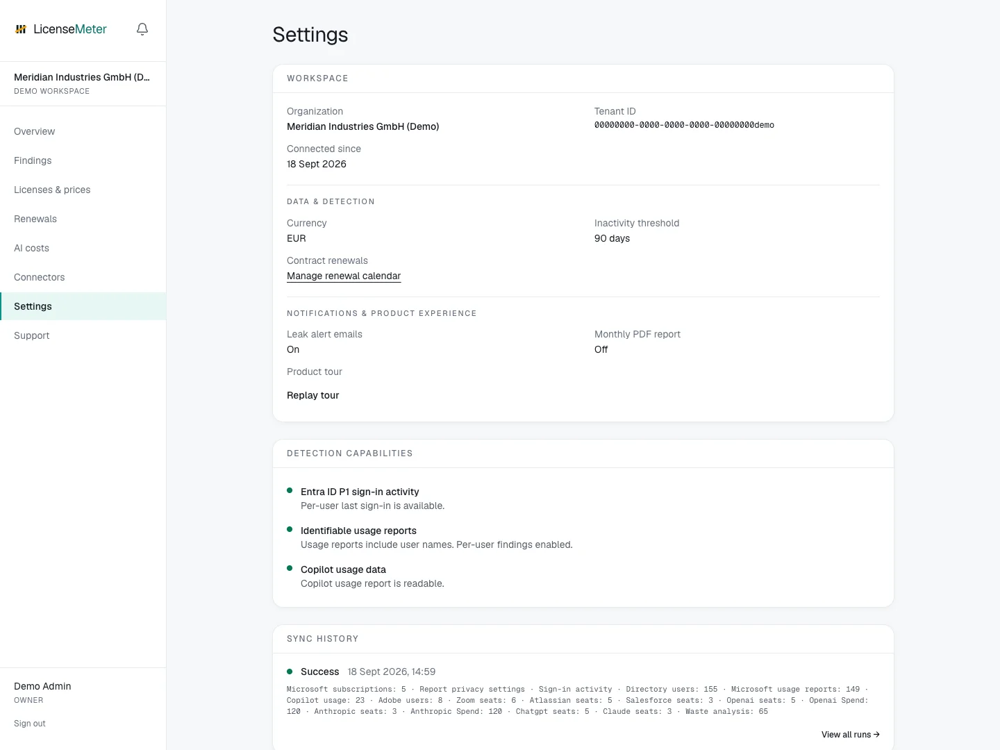

# Settings and sync history

Open **Settings** to review your workspace's data coverage, recent syncs and administrative preferences.

<figure><figcaption>
LicenseMeter sample workspace. All names, costs and findings shown are demonstration data.
</figcaption></figure>

## Data and detection

**Currency** controls the workspace's license-price presentation. Review your entered contract prices when changing it. AI API costs remain in USD on the AI costs pages.

**Inactivity threshold** determines the time window used for inactivity findings. Change it to reflect your review policy, then review the recalculated results. A threshold is a screening rule, not proof that a person no longer needs access.

**Detection capabilities** explains whether sign-in activity, identifiable usage reports and Copilot usage are available. A missing capability can limit a rule without making the entire connector unusable.

## Refresh and investigate

Use **Sync now** when available to refresh a connected workspace. Scheduled live sync runs daily at 03:00 UTC. Imported data requires a fresh import; an instant scan requires another scan.

For your first refresh, use the [first-sync checklist](../getting-started/first-sync.md). A partial run may still redirect to Overview. Check **Sync history** after a failed or partial refresh. Record the provider, timestamp and error before seeking help. Expired credentials, missing permissions and provider-side report availability need different fixes.

## Members and joining

Use **Members** to invite colleagues, resend expired invitations and manage their roles. Where company-domain joining is available, **Access requests** lets Admins and Owners approve or decline requests, and **Who can join** lets an Owner choose the policy. See the [membership walkthrough](members.md).

## Preferences and history

Settings exposes leak alert emails and monthly PDF report preferences where supported. [Emails from LicenseMeter](emails.md) shows each email, who receives it and how to turn it off. Self-hosted email delivery also depends on the operator's configured email service and scheduler. Use **Product tour** to replay the walkthrough.

**Shared notification address** lets Owners and Admins add one team mailbox that receives the workspace email in addition to the Owners and Admins, who all keep their own copy. The address is confirmed by email before anything is sent to it, and it has its own switches for the weekly digest, the monthly report and leak alerts. Everyone who can read that mailbox sees account names and license costs, so choose it deliberately. [Emails from LicenseMeter](emails.md) describes the confirmation and the switches in full.

The activity log records workspace actions. Its purpose is to explain changes inside LicenseMeter; it is not a replacement for a provider's own audit trail.

See [Troubleshooting](../troubleshooting/README.md) for common symptoms.
